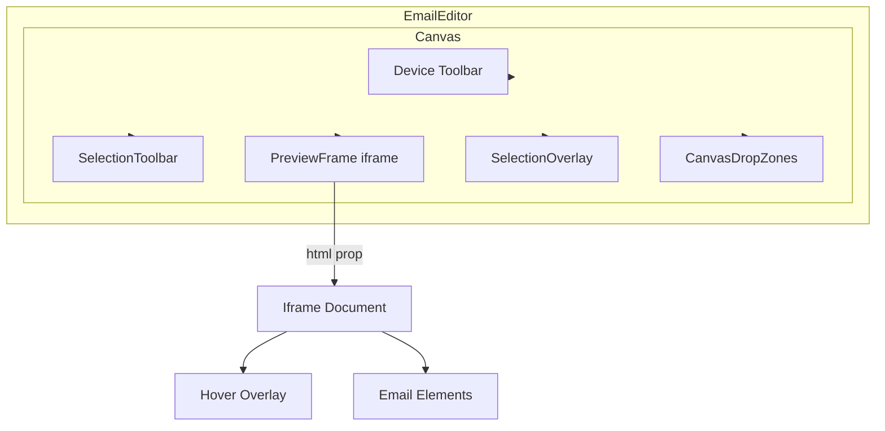
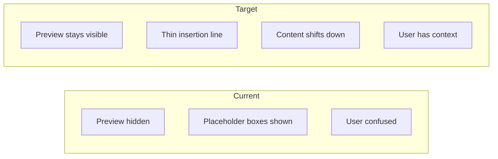
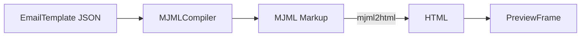
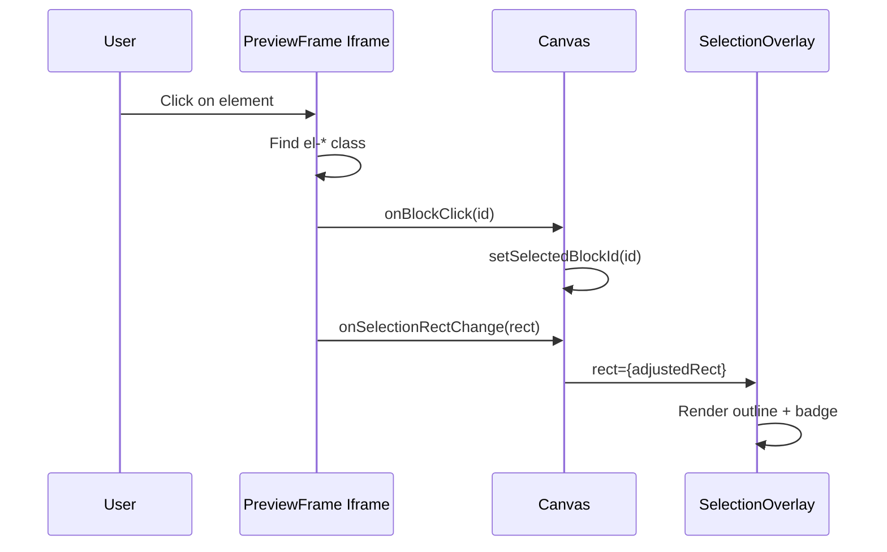
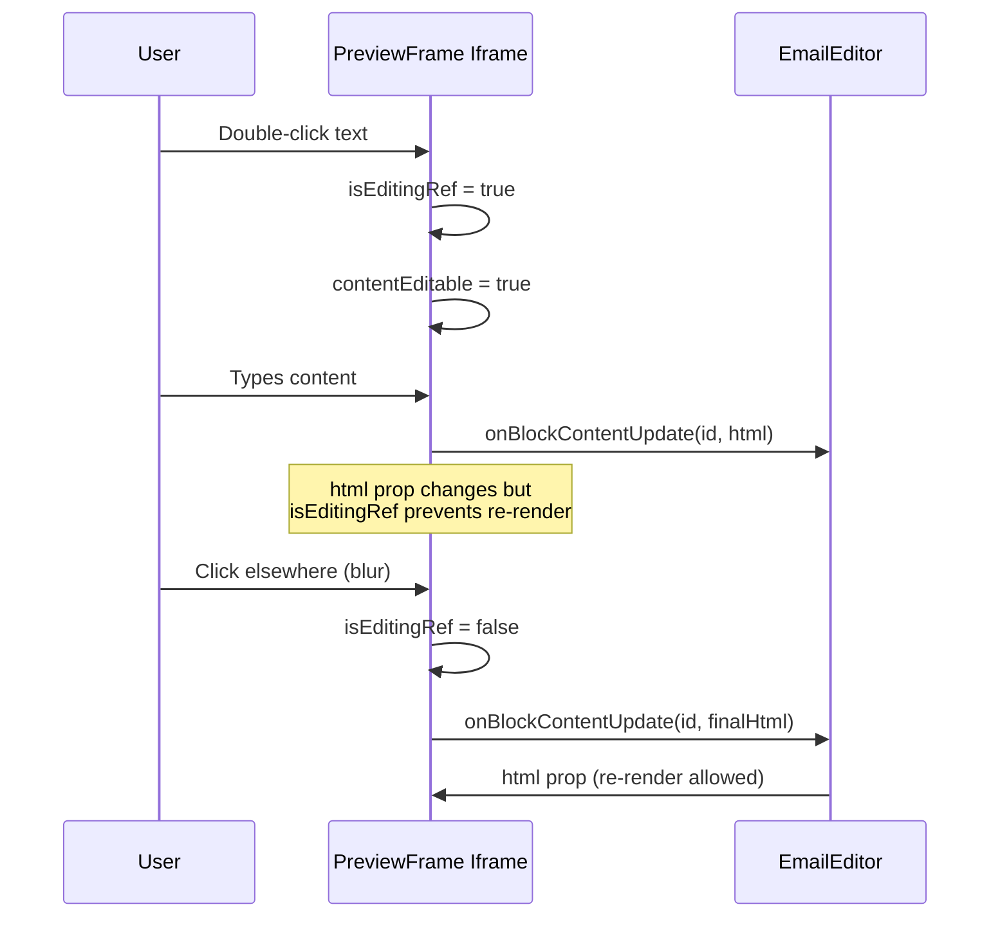

# Canvas Rendering Architecture

## Overview

The canvas is the central editing area where users see their email preview. It uses an iframe to isolate MJML-compiled HTML from the editor's styles.

---

## Component Hierarchy



---

## Key Components

### Canvas (`canvas/Canvas.tsx`)

Main container orchestrating the preview experience.

**State:**
- `device`: 'desktop' | 'mobile' - controls preview width
- `selectionRect`: Rectangle of selected element (for positioning overlays)

**Props Flow:**
```typescript
interface CanvasProps {
  html: string;                    // Compiled MJML HTML
  template: EmailTemplate;         // JSON template (for drop zones)
  selectedBlockId?: string | null;
  selectedSectionId?: string | null;
  selectedColumnId?: string | null;
  onBlockClick?: (blockId: string) => void;
  onBlockContentUpdate?: (blockId: string, content: string) => void;
  // ... toolbar actions
}
```

---

### PreviewFrame (`canvas/PreviewFrame.tsx`)

Iframe component that renders the actual email HTML.

**Key Responsibilities:**

1. **HTML Injection:** Writes compiled HTML to iframe via `doc.write()`
2. **CSS Overrides:** Injects styles to force desktop column layout
3. **Event Delegation:** Attaches click/hover handlers to `.el-*` elements
4. **Selection Reporting:** Reports selected element's rect to parent
5. **Inline Editing:** Makes text blocks contentEditable on double-click

**Critical Implementation Details:**

#### Focus Preservation During Editing

```typescript
// Refs to prevent re-render during editing
const isEditingRef = useRef(false);
const lastHtmlRef = useRef<string>('');

useEffect(() => {
  // Skip re-render if actively editing - preserves focus
  if (isEditingRef.current) return;
  
  // Skip if HTML unchanged - prevents unnecessary rebuilds
  if (lastHtmlRef.current === html) return;
  
  // Only then do we doc.write()
  lastHtmlRef.current = html;
  doc.write(...);
}, [html, ...]);
```

#### CSS Column Fixes

MJML outputs responsive CSS that stacks columns on mobile. The preview forces desktop layout:

```css
/* Force table-cell display on all column widths */
@media all and (min-width: 0px) {
  .mj-column-per-50 { width: 50% !important; }
  .mj-column-per-33 { width: 33.33% !important; }
  /* ... other widths */
  
  div.mj-outlook-group-fix,
  div[class*="mj-column"] {
    display: table-cell !important;
    vertical-align: top !important;
  }
}
```

#### Element Identification

Elements have CSS classes for identification:

| Class Pattern | Purpose |
|---------------|---------|
| `el-section` | Section container |
| `el-column` | Column container |
| `el-text`, `el-image`, etc. | Block type |
| `el-{id}` | Unique element ID |

```typescript
// Finding element ID from classList
const idClass = classList.find(c => 
  c.startsWith('el-') && 
  !['el-section', 'el-column', 'el-text', ...].includes(c)
);
const elementId = idClass.replace('el-', '');
```

---

### SelectionOverlay (`canvas/SelectionOverlay.tsx`)

External overlay rendered OUTSIDE the iframe, positioned over selected elements.

**Why External?**
- Handles can extend beyond element bounds
- Not affected by iframe CSS
- Can use React event handlers directly
- Drag handle uses dnd-kit integration

**Positioning:**

```typescript
// Coordinates from PreviewFrame are window-relative
// We convert to container-relative for positioning
const adjustedSelectionRect = selectionRect && containerRef.current
  ? {
      top: selectionRect.top - containerRect.top,
      left: selectionRect.left - containerRect.left,
      width: selectionRect.width,
      height: selectionRect.height,
    }
  : null;
```

**Features:**
- Selection outline with type badge
- Drag handle for reordering blocks (uses `useDraggable`)
- Resize handles (future)
- Border-radius handles (future)

---

### CanvasDropZones (`canvas/CanvasDropZones.tsx`)

**CRITICAL ISSUE:** Currently renders an opaque overlay that hides the preview.

#### Current Implementation (Problematic)

```typescript
// Line ~343 - This hides the preview!
<div className="absolute inset-0 flex flex-col bg-white/80 backdrop-blur-sm overflow-auto">
  {/* Renders placeholders like "text", "image" instead of actual content */}
</div>
```

**Problems:**
1. `bg-white/80` obscures email preview
2. Shows block types as text, not actual rendered content
3. User loses context of WHERE they're dropping

#### Target Implementation (Framer-like)



**Requirements for fix:**
1. Remove `bg-white/80` overlay
2. Keep `PreviewFrame` visible during drag
3. Render insertion lines as thin overlays
4. Use CSS transforms to shift content (not DOM replacement)

---

## Data Flow

### Compilation Pipeline



### Selection Flow



### Inline Editing Flow



---

## Known Issues

### 1. Drop Zones Hide Content

**Symptom:** During drag, user sees placeholder boxes instead of email preview.
**Cause:** `CanvasDropZones` renders opaque overlay.
**Fix:** Remove overlay, use insertion lines over visible preview.

### 2. Selection Overlay Z-Index

**Symptom:** Sometimes overlay appears behind iframe content.
**Cause:** z-index stacking context issues.
**Current Mitigation:** External overlay with high z-index.

### 3. Resize Handle Not Implemented

**Symptom:** `ResizeHandle` and `BorderRadiusHandle` exist but not integrated.
**Cause:** Handles need integration with store for preview-then-commit.
**Status:** Blocked by state migration.

---

## Performance Considerations

### Iframe Re-rendering

The entire iframe DOM is rebuilt on every `html` prop change (except during editing). This is expensive.

**Current Mitigations:**
- `lastHtmlRef` prevents re-render if HTML unchanged
- `isEditingRef` prevents re-render during editing

**Future Optimization:**
Consider DOM diffing or virtual DOM for iframe content.

### Selection Rect Reporting

Currently uses `setTimeout(reportSelectionRect, 100)` for initial report.

**Issue:** Race condition if HTML takes longer to render.
**Potential Fix:** Use `MutationObserver` or `requestAnimationFrame`.

---

## File Reference

| File | LOC | Purpose |
|------|-----|---------|
| `Canvas.tsx` | ~330 | Main canvas container |
| `PreviewFrame.tsx` | ~520 | Iframe rendering, event delegation |
| `SelectionOverlay.tsx` | ~200 | External selection overlay with handles |
| `CanvasDropZones.tsx` | ~400 | Drop zone overlay (needs redesign) |
| `SelectionToolbar.tsx` | ~150 | Floating toolbar above selection |

---

*Last updated: January 2026*

