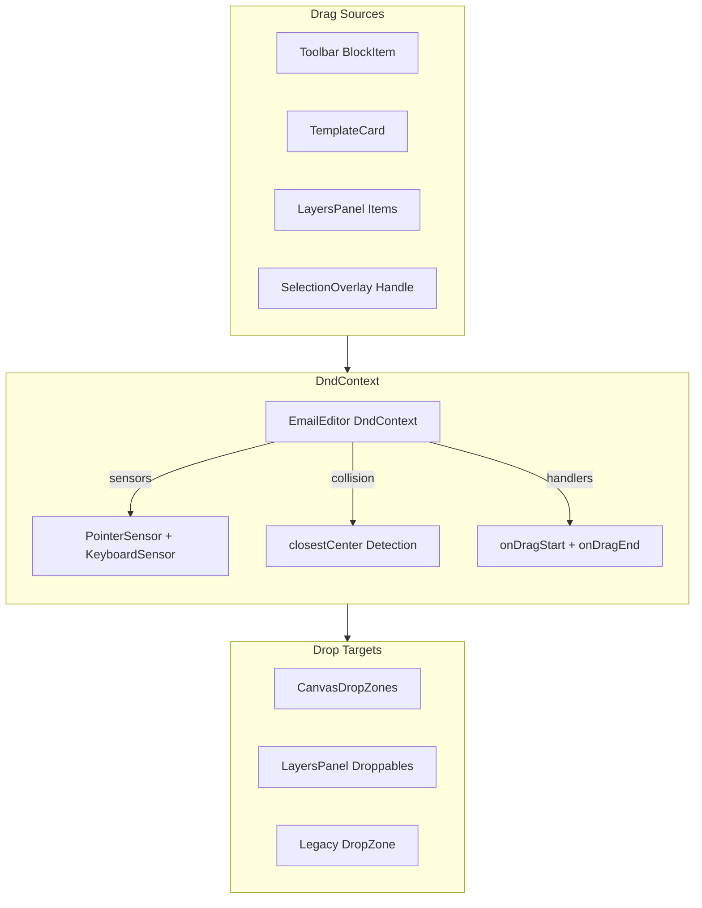
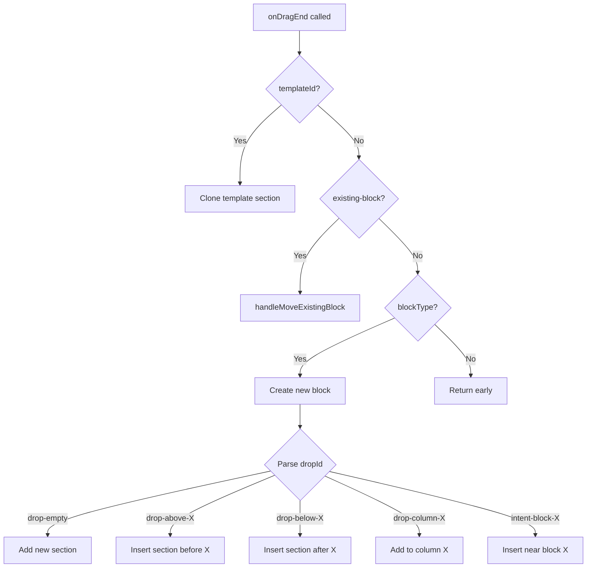

# Drag-and-Drop Architecture

## Overview

The email editor uses `@dnd-kit/core` for all drag-and-drop operations. This document describes the actual implementation, data flow, and integration points.

---

## System Components



---

## Drag Sources

### 1. Toolbar BlockItem (`toolbar/BlockItem.tsx`)

New blocks are dragged from the toolbar.

```typescript
// Data attached to draggable
{
  blockType: 'text' | 'image' | 'button' | 'divider' | 'spacer' | 'social' | 'html';
}
```

**ID Pattern:** `toolbar-{blockType}`

### 2. TemplateCard (`sidebar/TemplateCard.tsx`)

Pre-built templates (sections) are dragged from the sidebar.

```typescript
// Data attached to draggable
{
  templateId: string;  // References prebuiltRegistry
}
```

**ID Pattern:** `template-{templateId}`

### 3. LayersPanel Items (`layers/LayersPanel.tsx`)

Existing blocks can be dragged within the layers tree.

```typescript
// Data attached to draggable  
{
  type: 'existing-block';
  blockId: string;
  sourceColumnId: string;
}
```

**ID Pattern:** `layer-block-{blockId}`

### 4. SelectionOverlay Drag Handle (`canvas/SelectionOverlay.tsx`)

Selected blocks can be dragged via the badge's grip handle.

```typescript
// useDraggable configuration
const { attributes, listeners, setNodeRef } = useDraggable({
  id: `canvas-block-${selectedId}`,
  data: {
    type: 'existing-block',
    blockId: selectedId,
  },
});
```

**ID Pattern:** `canvas-block-{blockId}`

---

## Drop Targets

### CanvasDropZones (`canvas/CanvasDropZones.tsx`)

This component renders drop zones during drag operations. 

#### Drop Zone ID Patterns

| Pattern | Meaning | Handler |
|---------|---------|---------|
| `drop-empty` | Empty template, add first section | Creates section with single column |
| `drop-above-{sectionId}` | Gap before section | Inserts new section before |
| `drop-below-{sectionId}` | Gap after last section | Inserts new section after |
| `drop-column-{columnId}` | Anywhere on column | Adds block to end of column |
| `drop-column-end-{columnId}` | End of column | Adds block to end of column |
| `intent-block-{blockId}` | On/near a block | Inserts before that block |

#### Current Implementation Problem

The drop zones render an opaque overlay:

```tsx
// Line ~343 in CanvasDropZones.tsx
<div className="absolute inset-0 flex flex-col bg-white/80 backdrop-blur-sm overflow-auto">
```

This **completely hides** the email preview, showing only:
- Section labels with dashed borders
- Block type placeholders (`text`, `image`)
- No visual representation of actual email content

**This violates the "Framer-like" requirement** where content should stay visible with insertion indicators.

---

## Event Handlers

### `handleDragEnd` in EmailEditor.tsx

Main handler for all drag operations. Flow:



### `handleMoveExistingBlock` in EmailEditor.tsx

Handles moving existing blocks (from layers panel or canvas drag handle):

1. Finds source block and its location (columnId, index)
2. Parses drop zone ID to determine target
3. Updates template via history manager (for undo support)
4. Selects the moved block

---

## Drop Intent System

### useDropIntent Hook (`hooks/useDropIntent.ts`)

Calculates 3-way drop intent based on cursor position.

```
┌──────────────────────────┐ ← edgeThreshold (16px) = "before"
│                          │
│      "inside" zone       │
│                          │
└──────────────────────────┘ ← edgeThreshold (16px) = "after"
```

#### Magnet Zones

- **edgeThreshold:** 16px from top/bottom edge
- **minInsideHeight:** 32px minimum for "inside" to be valid
- Small elements (< 32px) only have before/after

#### Fallback Logic

If `canAcceptChildren` is false, "inside" falls back to "after".

---

## Integration Issues

### 1. State Management Disconnection

The DnD handlers in `EmailEditor.tsx` still use:
- `useState(template)` - local state
- `history.updateState()` - legacy HistoryManager

They **should** use:
- `useDocumentState()` from Zustand store
- Store actions with history middleware

### 2. Validation Not Enforced

The validation middleware in `store/middleware/validation.ts` is never called because mutations go through `history.updateState()` instead of store actions.

### 3. Canvas vs Layers Inconsistency

- **Layers Panel:** Uses `@dnd-kit/sortable` for reordering
- **Canvas:** Uses basic `useDroppable` with manual position calculation

This causes different behaviors when dragging to/from each panel.

---

## Recommended Improvements

### Short Term (Bug Fixes)

1. **Fix drop zone overlay:** Remove `bg-white/80` to keep preview visible
2. **Show insertion lines:** Use `InsertionLine` component from `CanvasDropZones.tsx`
3. **Fix block movement:** Ensure canvas drag handle properly triggers drop

### Medium Term (Architecture)

1. **Unify drag sources:** All should use consistent data structure:
   ```typescript
   interface DragData {
     type: 'new-block' | 'existing-block' | 'template';
     blockType?: string;
     blockId?: string;
     templateId?: string;
     sourceColumnId?: string;
   }
   ```

2. **Migrate to Zustand:** Replace `handleDragEnd` mutations with store actions

3. **Add collision detection modes:** Different algorithms for toolbar vs canvas drags

### Long Term (UX)

1. **Preview-then-commit:** Show ghost position during drag, only commit on drop
2. **Animated content shifting:** Smooth transitions when insertion indicator moves
3. **Cross-panel dragging:** Drag from layers to canvas and vice versa seamlessly

---

## File Reference

| File | Purpose |
|------|---------|
| `EmailEditor.tsx` | DndContext provider, handleDragEnd |
| `canvas/CanvasDropZones.tsx` | Drop zones overlay (needs redesign) |
| `canvas/SelectionOverlay.tsx` | Drag handle for selected blocks |
| `layers/LayersPanel.tsx` | Tree drag-and-drop |
| `toolbar/BlockItem.tsx` | Toolbar drag sources |
| `sidebar/TemplateCard.tsx` | Template drag sources |
| `hooks/useDropIntent.ts` | 3-way intent calculation |

---

*Last updated: January 2026*

