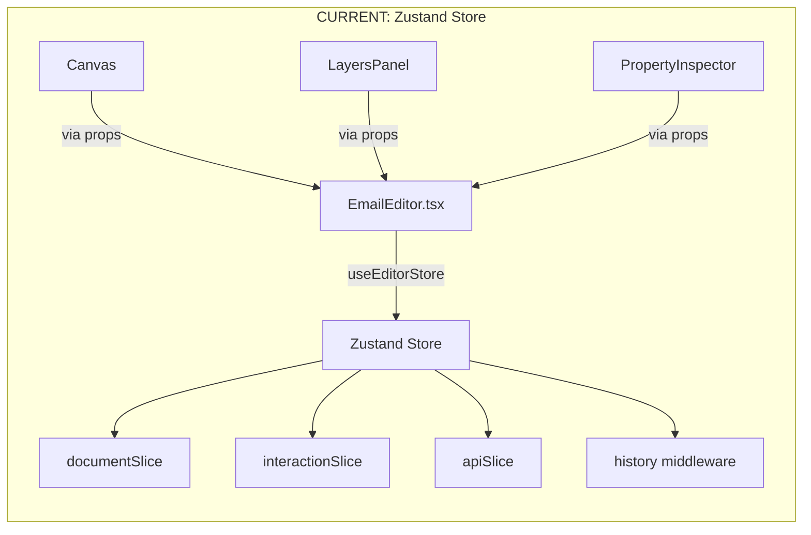
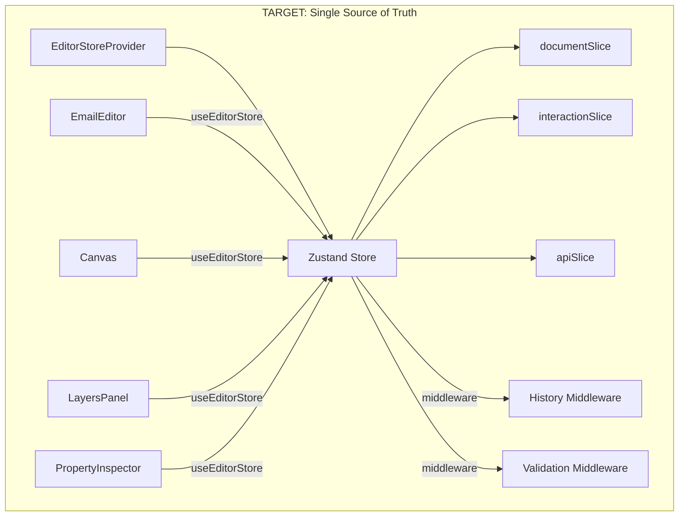

# State Management Architecture

## Overview

The email editor has **two state systems** that currently exist in parallel. This document clarifies the actual state of implementation and provides a migration path.

---

## Current State: Unified Zustand Store (MIGRATED!)

**As of 2026-01-04, EmailEditor.tsx now uses Zustand store.**



### Zustand Store (NOW IN USE!)

Located in `packages/core/src/store/`:

```typescript
// EmailEditor.tsx imports and uses this
const template = useEditorStore((state) => state.template);
const undo = useEditorStore((state) => state.undo);
const storeInsertBlock = useEditorStore((state) => state.insertBlock);
// ... etc
```

### Legacy Code (REMOVED)

The following are NO LONGER in EmailEditor.tsx:
- ~~`const [template, setTemplate] = useState(value);`~~
- ~~`const [history] = useState(() => createHistoryManager(value));`~~

---

## Store Usage Status

| Component | Uses Zustand Store | Notes |
|-----------|-------------------|-------|
| EmailEditor | ✅ Yes | Direct store access |
| Canvas | ✅ (via props) | Gets state from EmailEditor |
| PreviewFrame | ✅ (via props) | Gets state from EmailEditor |
| LayersPanel | ✅ (via props) | Gets state from EmailEditor |
| PropertyInspector | ✅ (via props) | Gets state from EmailEditor |

---

## Target State: Unified Zustand Store



---

## Zustand Store Structure

### Document Slice (`documentSlice.ts`)

Authoritative template state. All mutations tracked by history.

```typescript
interface DocumentState {
  template: EmailTemplate;
  
  // Template operations
  setTemplate: (template: EmailTemplate) => void;
  
  // Block operations
  insertBlock: (columnId: string, index: number, block: Block) => void;
  moveBlock: (blockId: string, targetColumnId: string, targetIndex: number) => void;
  updateBlock: (blockId: string, updates: Partial<Block>) => void;
  deleteBlock: (blockId: string) => void;
  
  // Section operations
  insertSection: (index: number, section: Section) => void;
  moveSection: (sectionId: string, targetIndex: number) => void;
  updateSection: (sectionId: string, updates: Partial<Section>) => void;
  deleteSection: (sectionId: string) => void;
  
  // Column operations
  updateColumn: (columnId: string, updates: Partial<Column>) => void;
  setColumnCount: (sectionId: string, count: number) => void;
  
  // mj-group abstraction
  setMobileHorizontal: (sectionId: string, enabled: boolean) => void;
  
  // Metadata
  updateMetadata: (updates: Partial<EmailMetadata>) => void;
  
  // History (provided by middleware)
  undo: () => void;
  redo: () => void;
  canUndo: () => boolean;
  canRedo: () => boolean;
  clearHistory: () => void;
}
```

### Interaction Slice (`interactionSlice.ts`)

Ephemeral UI state. NOT tracked by history (no undo for hover states).

```typescript
interface InteractionState {
  // Selection
  selectedId: string | null;
  selectedType: SelectionType | null;
  setSelection: (id: string | null, type: SelectionType | null) => void;
  clearSelection: () => void;
  
  // Drag state
  dragState: DragState;
  startDrag: (id: string, type: 'block' | 'section' | 'template') => void;
  updateDropIntent: (intent: DropIntent | null) => void;
  endDrag: () => void;
  
  // Resize state (preview-then-commit)
  resizeState: ResizeState;
  startResize: (targetId: string, handleType: HandleType, originalValue: string) => void;
  updateResizePreview: (value: string) => void;
  commitResize: () => void;
  cancelResize: () => void;
}
```

### API Slice (`apiSlice.ts`)

Configuration for remote compile API (monetization).

```typescript
interface APIState {
  apiKey: string | null;
  compileEndpoint: string | null;
  isPreviewMode: boolean;
  
  setAPIKey: (key: string | null) => void;
  setCompileEndpoint: (endpoint: string | null) => void;
  setPreviewMode: (isPreview: boolean) => void;
}
```

---

## History Systems Comparison

### Legacy HistoryManager (Currently Used)

```typescript
// packages/core/src/history/HistoryManager.ts
class HistoryManager<T> {
  private history: T[] = [];
  private currentIndex = -1;
  
  updateState(producer: (draft: Draft<T>) => void): T {
    // Uses Immer to produce new state
    // Stores FULL snapshots in history array
  }
}

// Usage in EmailEditor.tsx
const [history] = useState(() => createHistoryManager(value));
const newTemplate = history.updateState((draft) => {
  draft.sections.push(newSection);
});
setTemplate(newTemplate);
```

**Problems:**
- Stores full template snapshots (memory inefficient)
- Not integrated with store actions
- Validation middleware never runs

### Zustand History Middleware (Target)

```typescript
// packages/core/src/store/middleware/history.ts
export const createHistoryMiddleware = (config: StateCreator<EditorStore>) => {
  return (set, get, api) => {
    let isUndoRedo = false;
    
    const trackedSet = (partial, replace) => {
      const prevTemplate = get().template;
      set(partial);
      const newTemplate = get().template;
      
      if (!isUndoRedo && prevTemplate !== newTemplate) {
        historyState.past.push(prevTemplate);
        historyState.future = [];
      }
    };
    
    return {
      ...config(trackedSet, get, api),
      undo: () => { ... },
      redo: () => { ... },
    };
  };
};
```

**Advantages:**
- Integrated with all store actions
- Automatic tracking of template changes
- Validation middleware can intercept mutations

---

## Migration Plan

### Step 1: Wrap EmailEditor with Provider

```tsx
// In app code or EmailEditor.tsx
import { EditorStoreProvider } from '@returnhypnosis/email-editor-ui/store';

<EditorStoreProvider>
  <EmailEditor {...props} />
</EditorStoreProvider>
```

### Step 2: Replace Local State with Store Selectors

```diff
// Before
- const [template, setTemplate] = useState(value);
- const [selectedBlockId, setSelectedBlockId] = useState<string | null>(null);

// After
+ const template = useEditorStore((state) => state.template);
+ const setTemplate = useEditorStore((state) => state.setTemplate);
+ const selectedId = useEditorStore((state) => state.selectedId);
+ const setSelection = useEditorStore((state) => state.setSelection);
```

### Step 3: Replace Legacy History Manager

```diff
// Before
- const [history] = useState(() => createHistoryManager(value));
- const newTemplate = history.updateState((draft) => {
-   draft.sections.push(newSection);
- });
- setTemplate(newTemplate);

// After
+ const insertSection = useEditorStore((state) => state.insertSection);
+ insertSection(0, newSection);
// History is automatically tracked by middleware
```

### Step 4: Update Child Component Props

Move from prop drilling to direct store access:

```diff
// Before (Canvas.tsx)
- <Canvas
-   template={template}
-   selectedBlockId={selectedBlockId}
-   onBlockClick={handleBlockClick}
- />

// After (Canvas.tsx)
+ function Canvas() {
+   const template = useEditorStore((state) => state.template);
+   const selectedId = useEditorStore((state) => state.selectedId);
+   const setSelection = useEditorStore((state) => state.setSelection);
+ }
```

---

## Verification Checklist (COMPLETED 2026-01-04)

All items verified:

- [x] `EmailEditor.tsx` has NO `useState(template)` ✓
- [x] `EmailEditor.tsx` has NO `useState(selectedBlockId)` ✓
- [x] `EmailEditor.tsx` has NO `createHistoryManager()` ✓
- [x] All template mutations use store actions (`insertBlock`, `moveBlock`, etc.) ✓
- [x] Undo/redo uses store's `undo()` / `redo()` ✓
- [x] Selection uses store's `setSelection()` / `clearSelection()` ✓
- [ ] `EditorStoreProvider` wraps the editor - Direct store access works

---

## File Reference

| File | Purpose | Migration Status |
|------|---------|------------------|
| `core/store/index.ts` | Store creation | ✅ Complete |
| `core/store/documentSlice.ts` | Document state | ✅ Complete |
| `core/store/interactionSlice.ts` | Interaction state | ✅ Complete |
| `core/store/apiSlice.ts` | API config | ✅ Complete |
| `core/store/middleware/history.ts` | History tracking | ✅ Complete |
| `core/history/HistoryManager.ts` | Legacy class | ⚠️ To be removed |
| `ui/src/EmailEditor.tsx` | Main component | ❌ Needs migration |
| `ui/src/store/EditorStoreProvider.tsx` | Provider wrapper | ✅ Complete |

---

*Last updated: January 2026*

