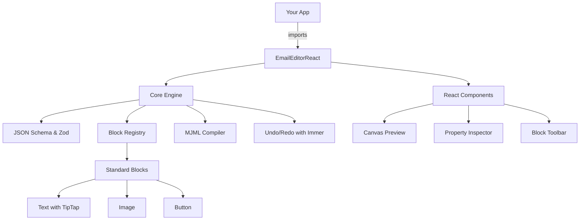

# Email Editor Platform Implementation

## Architecture Overview

## Phase 1: Repository Setup & Core Foundation

### Initialize Turborepo Monorepo

- Create new repository `email-editor`
- Setup Turborepo with packages: `core`, `ui`, `blocks`, `editor`
- Configure TypeScript (strict mode), ESLint, Prettier
- Setup tsup for package bundling

### Define Core JSON Schema

- Create EmailTemplate interface with Zod validation
- Define Section, Column, Block types
- Implement type-safe block variants (Text, Image, Button, Divider, Spacer)
- Add metadata (subject, preview text)

**Key Files:**

- `packages/core/src/schema/types.ts` - Core interfaces
- `packages/core/src/schema/validation.ts` - Zod schemas

### Build Block Registry System

- Create `BlockRegistry` class for registering custom blocks
- Define `BlockDefinition` interface with `type`, `label`, `icon`, `toMJML`, `propSchema`
- Implement registration and lookup methods
- Add default block definitions

**Key Files:**

- `packages/core/src/registry/BlockRegistry.ts`
- `packages/core/src/registry/types.ts`

### Implement MJML Compiler

- Create `MJMLCompiler` class that converts EmailTemplate JSON → MJML → HTML
- Use official `mjml` package for compilation
- Handle errors and validation
- Add unit tests for each block type

**Key Files:**

- `packages/core/src/compiler/MJMLCompiler.ts`
- `packages/core/src/compiler/__tests__/compiler.test.ts`

### Add History Manager with Immer

- Create undo/redo state manager using Immer for immutable updates
- Track state snapshots with max history size
- Expose `undo()`, `redo()`, `canUndo`, `canRedo` methods

**Key Files:**

- `packages/core/src/history/HistoryManager.ts`

## Phase 2: React UI Components

### Setup UI Package

- Initialize React 18 + TypeScript
- Configure Tailwind CSS with design tokens
- Add Radix UI components (Dialog, DropdownMenu, Tooltip, Tabs)
- Setup dnd-kit for drag and drop

### Build Canvas Component

- Create iframe-based preview that renders compiled HTML
- Implement click-to-select block functionality
- Add hover states and selection outlines
- Handle device preview (desktop/mobile toggle)

**Key Files:**

- `packages/ui/src/canvas/Canvas.tsx`
- `packages/ui/src/canvas/PreviewFrame.tsx`

### Create Block Toolbar

- Display available blocks from registry
- Implement drag source using dnd-kit
- Add category grouping (Text, Media, Layout, Brand)
- Include search/filter

**Key Files:**

- `packages/ui/src/toolbar/BlockToolbar.tsx`
- `packages/ui/src/toolbar/BlockItem.tsx`

### Build Property Inspector

- Auto-generate forms from block Zod schemas
- Create field components (text input, color picker, alignment selector)
- Handle real-time updates with debouncing
- Add validation feedback

**Key Files:**

- `packages/ui/src/inspector/PropertyInspector.tsx`
- `packages/ui/src/inspector/fields/` - Individual field components

### Main Editor Layout

- Create 3-panel layout (Toolbar | Canvas | Inspector)
- Add top toolbar with undo/redo, device preview, save
- Implement responsive behavior
- Add keyboard shortcuts (Cmd+Z, Delete)

**Key Files:**

- `packages/ui/src/EmailEditor.tsx`

## Phase 3: Standard Blocks Library

### Text Block with TipTap

- Integrate TipTap editor for rich text editing
- Support bold, italic, underline, links, headings
- Add alignment, color, font size controls
- Convert TipTap JSON to MJML `<mj-text>`

**Key Files:**

- `packages/blocks/src/text/TextBlock.tsx`
- `packages/blocks/src/text/TipTapEditor.tsx`

### Image Block

- URL input with preview
- Alt text, width, alignment options
- Convert to `<mj-image>`

### Button Block

- Label, link, alignment
- Background color, text color, border radius
- Convert to `<mj-button>`

### Divider & Spacer

- Simple divider with color/width options
- Spacer with height control

**Key Files:**

- `packages/blocks/src/image/ImageBlock.tsx`
- `packages/blocks/src/button/ButtonBlock.tsx`
- `packages/blocks/src/divider/DividerBlock.tsx`

## Phase 4: Public API

### Create Editor Factory Function

- Implement `createEditor(options)` as framework-agnostic API
- Accept `container`, `initialValue`, `theme`, `blocks`, `onChange`, `onCompile` callbacks
- Return editor instance with `getValue()`, `setValue()`, `getHTML()`, `getMJML()`, `undo()`, `redo()`, `destroy()`

**Key Files:**

- `packages/editor/src/createEditor.ts`
- `packages/editor/src/types.ts` - Public API types

### Build React Wrapper

- Create `<EmailEditorReact>` component wrapper
- Accept `value`, `onChange`, `theme`, `blocks` props
- Handle React lifecycle and cleanup

**Key Files:**

- `packages/editor/src/react/EmailEditorReact.tsx`

### Package Configuration

- Setup NPM package exports for `@returnhypnosis/email-editor` and `@returnhypnosis/email-editor/react`
- Configure peer dependencies (React, ReactDOM)
- Create production build pipeline

## Phase 5: Custom ReTurn Blocks

### Branded Header Block

- Locked, non-editable header with ReTurn logo
- "Welcome to the ReTurn Newsletter" text
- White background, branded styling

### Branded Footer Block

- Locked footer with social links, unsubscribe
- ReTurn branding

### Theme Configuration

- Primary color: `#944923`
- Font: Georgia, serif
- Export as `returnTheme` constant

**Key Files:**

- `packages/blocks/src/branded/ReturnHeader.tsx`
- `packages/blocks/src/branded/ReturnFooter.tsx`
- `examples/return-theme/theme.ts`

## Phase 6: Integration Example

### Create Next.js Example

- Setup example app in `examples/nextjs`
- Demonstrate `<EmailEditorReact>` usage
- Show server-side MJML compilation API route
- Include save/load functionality

**Key Files:**

- `examples/nextjs/app/page.tsx`
- `examples/nextjs/app/api/compile/route.ts`

## Tech Stack Summary

**Core:** TypeScript (strict), Zod, Immer, MJML**UI:** React 18, Tailwind CSS, Radix UI, dnd-kit, TipTap**Build:** Turborepo, tsup, Vitest**Deploy:** NPM registry

## Success Criteria

- Can drag blocks from toolbar to canvas
- Can edit block properties in inspector
- Can undo/redo changes