# Automations in Lumitra Mail

## Why

The mail-service plan (`docs/plans/2026-09-18-mail-service.md`, completed) lists
automations under "Later, in their own plans": the existing engine in
`packages/automation` detached from the contacts and campaigns packages, plus a
visual flow canvas. This is that plan. A marketing platform without automations
(welcome series, re-engagement, date-based mails, follow-ups on a client's own
events) is not one a newsletter sender or a small business will pick, and a
client with its own application (ŌPUNTIA) wants to hand a person to a sequence
with one API call instead of scheduling each mail itself.

MailerLite is the reference: its automation builder is the one small senders
know, it is simple enough to copy the good parts of, and its gaps are easy to
see. The research below was done read-only in Marlin's MailerLite trial account
(2026-09-19) and from MailerLite's public help pages.

## Research: MailerLite's automations

Screenshots live in `docs/research/mailerlite-automations/`. Each fact below is
marked by where it comes from: **seen** (in the account), **help** (MailerLite's
public help pages), or **not observable** (the trial account has no subscribers,
so views that only exist once a workflow has run could not be opened).

The account was a fresh 14-day trial with one draft workflow named "test"
(already open in the browser before the research began). Nothing was created,
saved, activated or dragged onto a canvas: MailerLite saves a draft as soon as a
step is dropped, so step settings were read from the template previews and the
help pages instead.

### The automation list

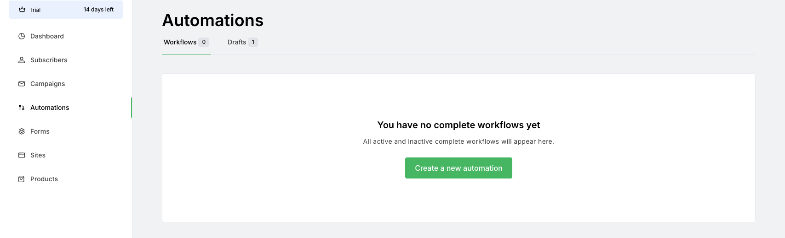
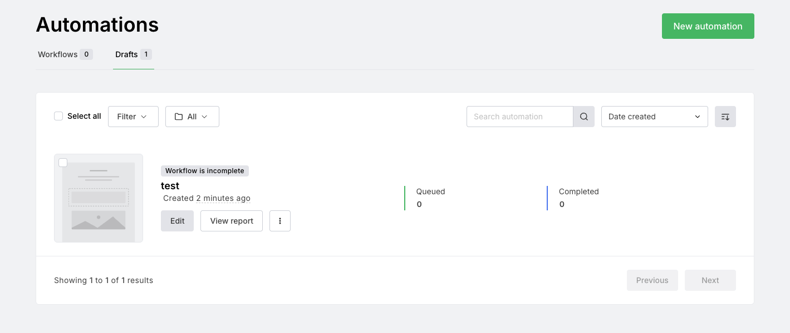

- **Seen.** Two tabs: *Workflows* (complete ones, active or inactive) and
  *Drafts*. A draft that cannot run says so on its row ("Workflow is
  incomplete", "No emails"). Each row: name, created time, *Edit*, *View report*,
  and two counters, *Queued* and *Completed*. *Select all* (bulk actions), a
  *Filter* and a sort by *Date created*. *New automation* top right.
- The split between complete and draft workflows is a good idea: an
  incomplete flow never sits among live ones looking like it works.

### Starting a workflow: scratch or template

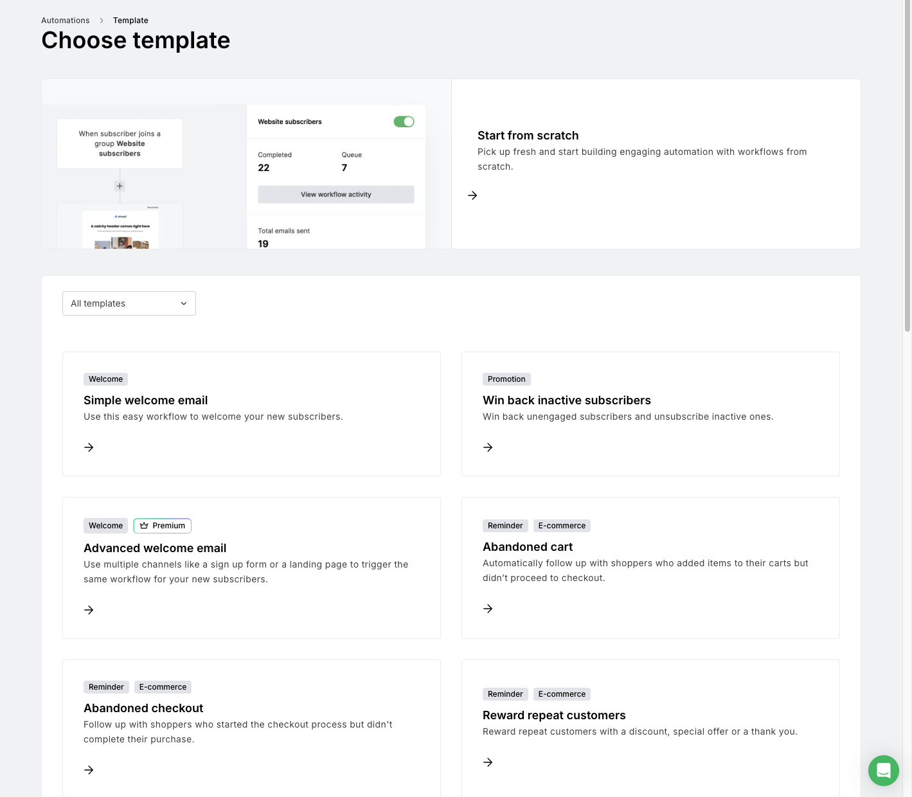

- **Seen.** *New automation* opens a gallery: *Start from scratch* plus 18
  templates, each tagged by purpose (Welcome, Promotion, Reminder, Feedback,
  Event, Special date) and some by *E-commerce* or *Premium* (a paid plan).
  The 18: Simple welcome email; Win back inactive subscribers; Advanced welcome
  email (Premium); Abandoned cart; Abandoned checkout; Reward repeat customers;
  Purchase specific product; Purchase any product; Promote specific product
  (all five e-commerce); New promotion; Retarget subscribers; Online course;
  Webinar invitation (Premium); Birthday wishes; Premium members; Demo call
  invitation (Premium); Membership renewal; NPS survey (Net Promoter Score,
  the "how likely are you to recommend us, 0 to 10" survey).
- **Seen.** *Preview* shows the template's flow on a read-only canvas beside a
  description and a "Workflow steps" list, with arrows to page through
  templates, and *Select template*. E-commerce templates show a banner that a
  connected store is required.

The previews are the clearest picture of the step types and their settings:

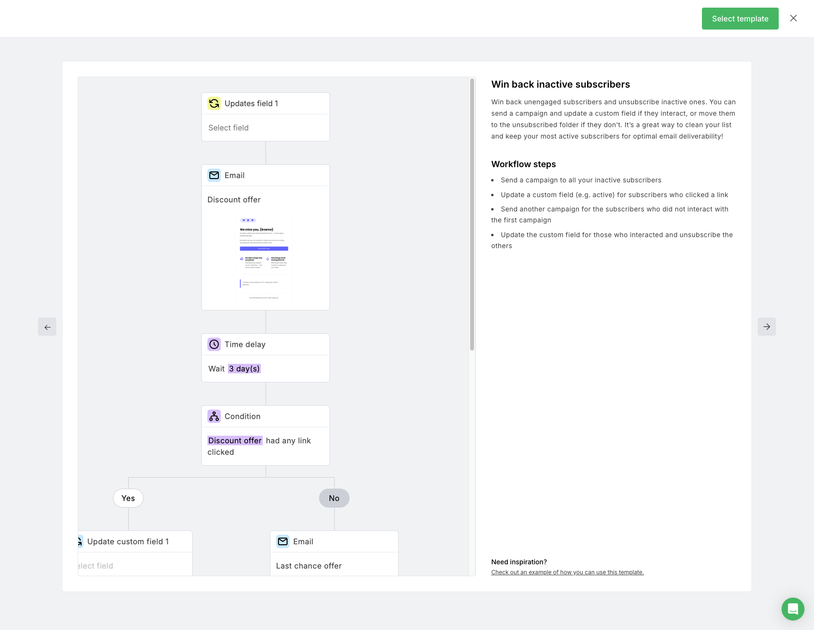
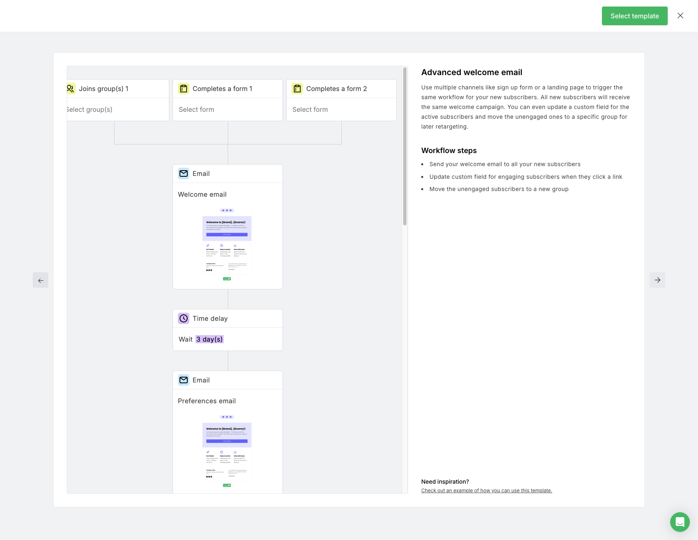
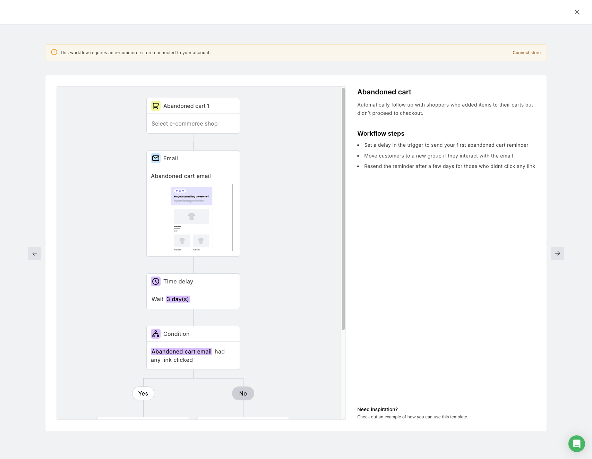
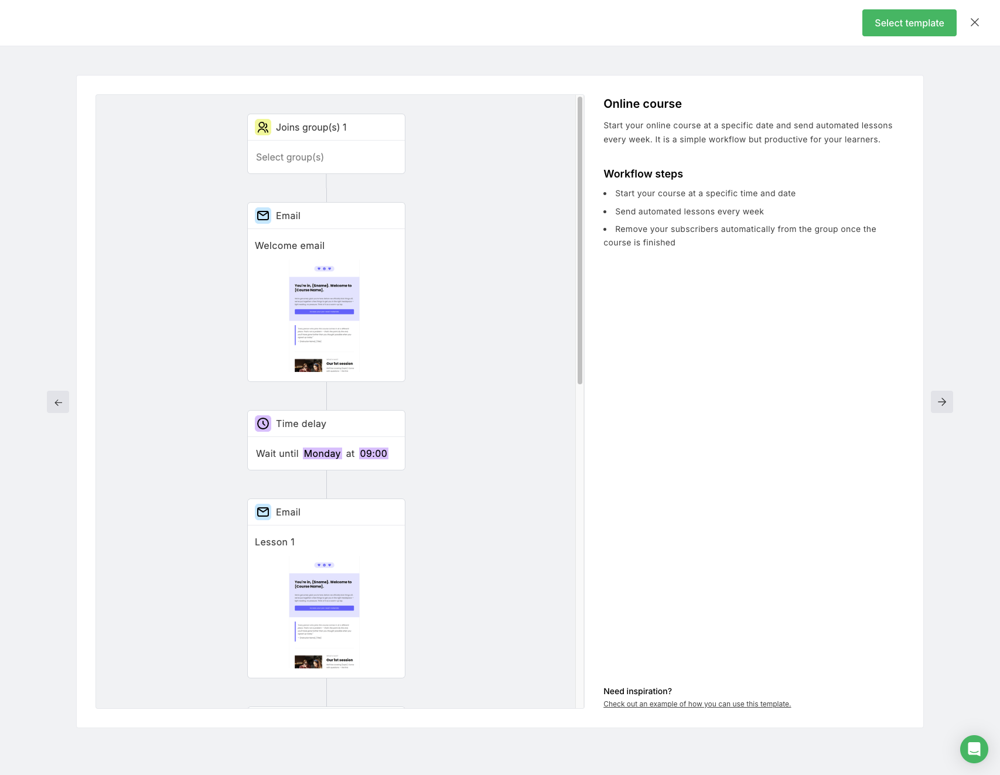
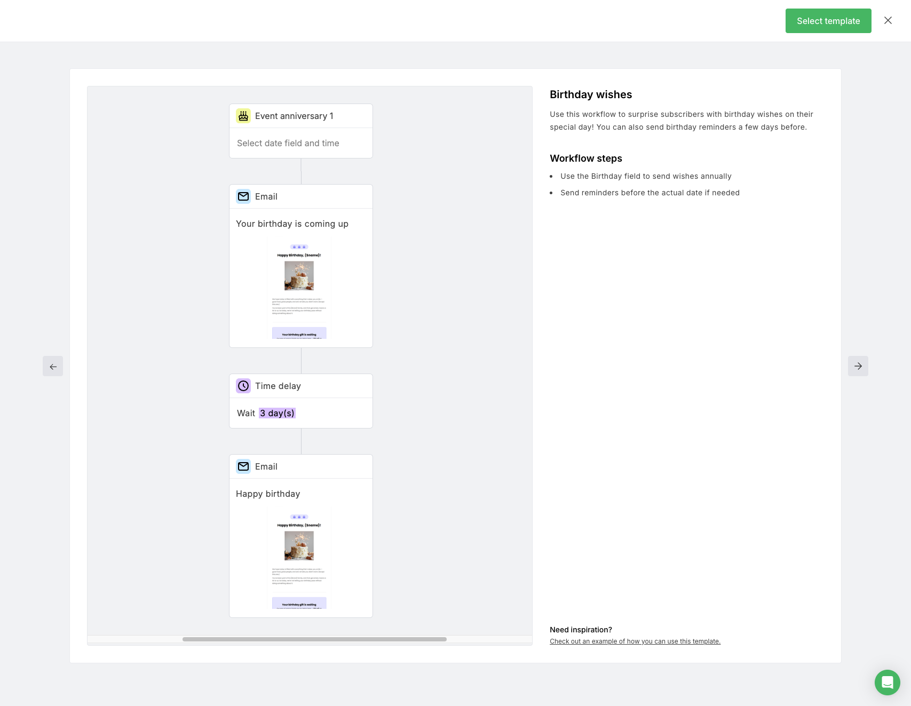
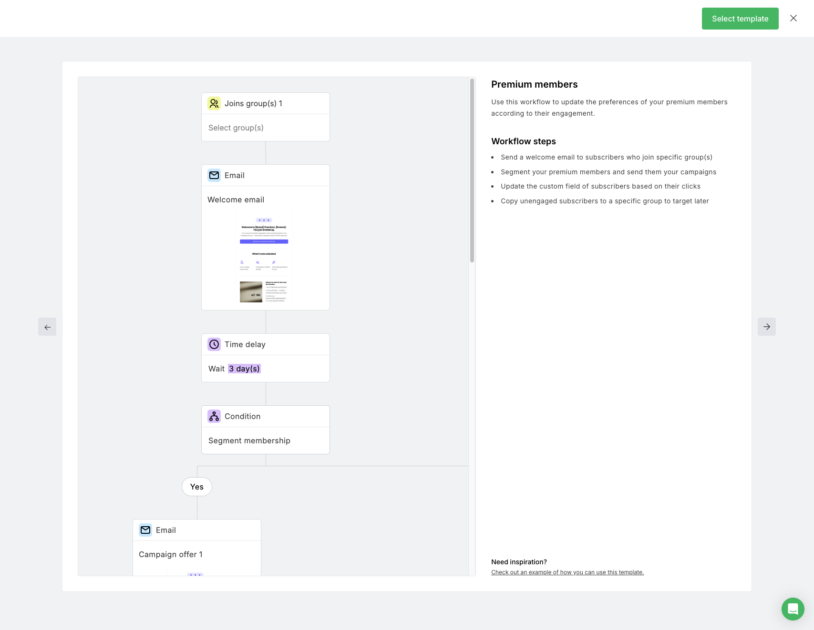

### The builder

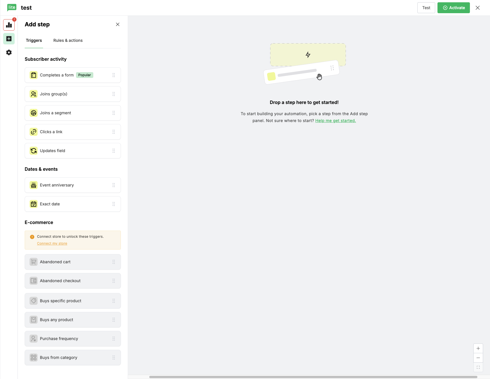
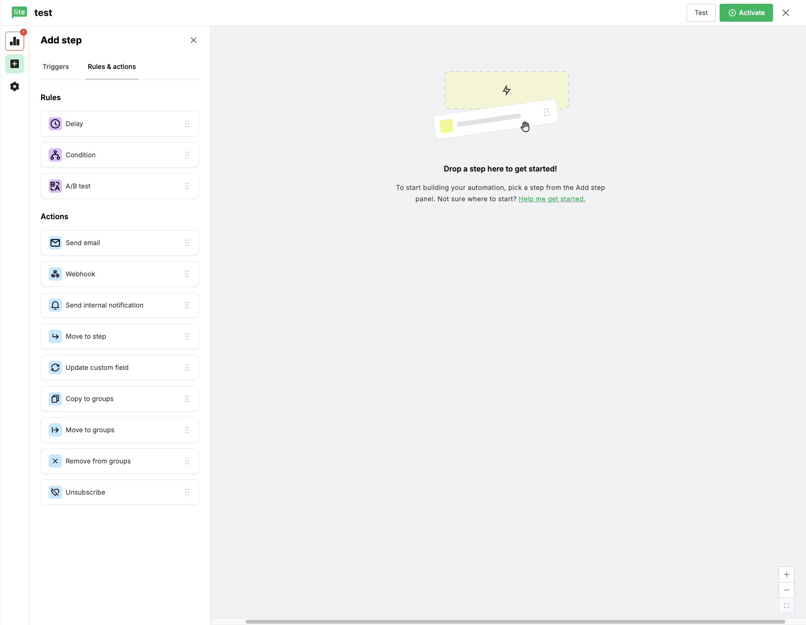

- **Seen.** Full-screen editor: the name top left, *Test* and *Activate* top
  right, a narrow left rail with three panels (report, *Add step*, settings),
  a grey canvas with zoom in, zoom out and fit controls bottom right. The empty
  canvas says "Drop a step here to get started!" with an illustration of the
  drag gesture and a *Help me get started* link to the help centre.
- **Seen.** *Add step* has two tabs. *Triggers*: Subscriber activity
  (Completes a form, marked Popular; Joins group(s); Joins a segment; Clicks a
  link; Updates field), Dates and events (Event anniversary; Exact date),
  E-commerce (Abandoned cart; Abandoned checkout; Buys specific product; Buys
  any product; Purchase frequency; Buys from category; all greyed out until a
  store is connected). *Rules & actions*: Rules (Delay; Condition; A/B test)
  and Actions (Send email; Webhook; Send internal notification; Move to step;
  Update custom field; Copy to groups; Move to groups; Remove from groups;
  Unsubscribe).
- **Seen.** Steps are cards dragged from the panel onto the canvas; the flow is
  a top-down tree. Several triggers can feed one flow (Advanced welcome shows
  three trigger cards joining above the first email). A condition splits into
  a *Yes* and a *No* branch side by side. Each card shows its type and a
  one-line summary with the configured values highlighted ("Wait 3 day(s)",
  "Wait until Monday at 09:00", "Discount offer had any link clicked",
  "Segment membership"); an email card shows a thumbnail of the email.

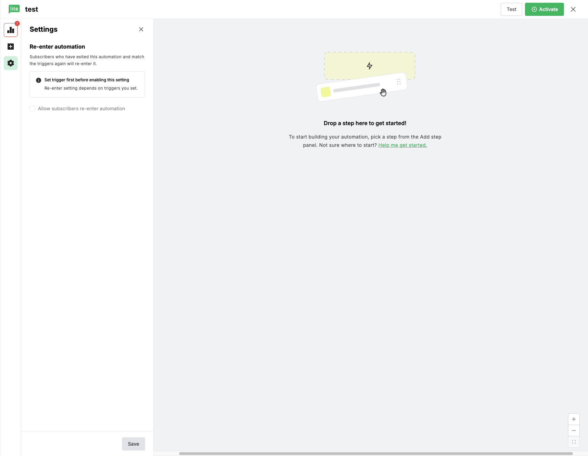

- **Seen.** Workflow settings hold one switch: *Re-enter automation*,
  "Subscribers who have exited this automation and match the triggers again will
  re-enter it", disabled until a trigger is set ("Re-enter setting depends on
  triggers you set").

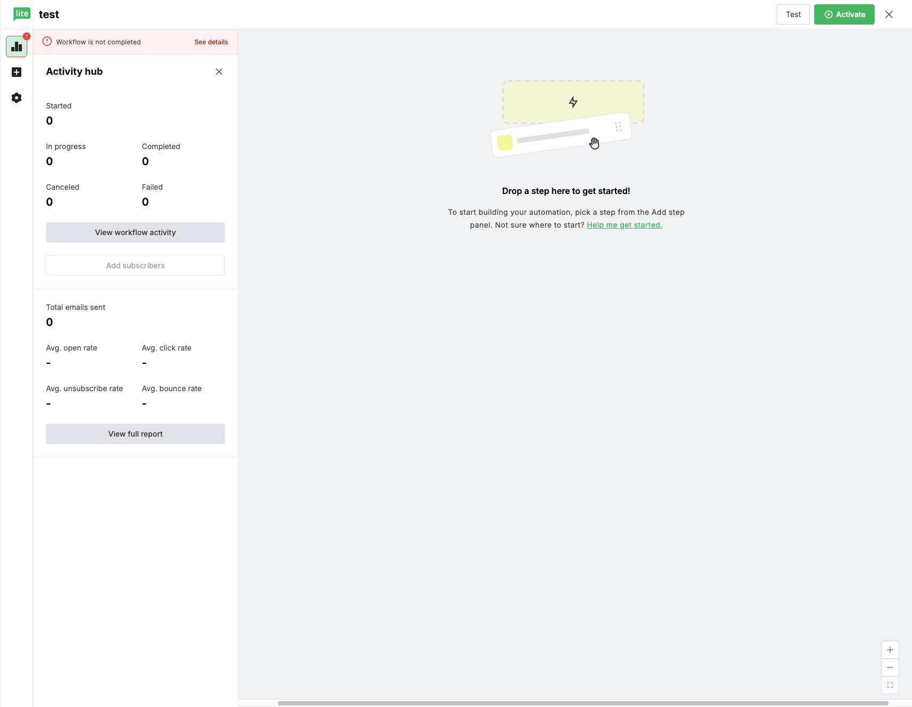
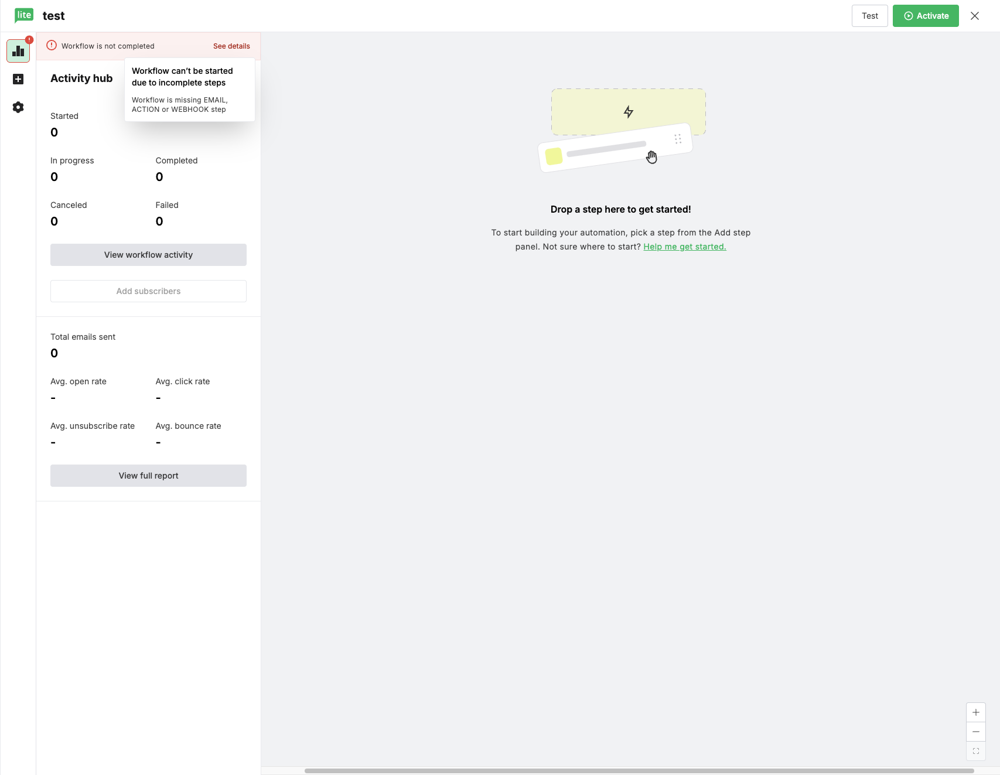

- **Seen.** The report panel, even on a draft: a validation banner
  ("Workflow is not completed", *See details*: "Workflow can't be started due to
  incomplete steps. Workflow is missing EMAIL, ACTION or WEBHOOK step"), an
  *Activity hub* with five counters (Started, In progress, Completed, Canceled,
  Failed), *View workflow activity*, *Add subscribers* (enrol people by hand),
  email totals (Total emails sent, Avg. open rate, Avg. click rate, Avg.
  unsubscribe rate, Avg. bounce rate) and *View full report*.
- **Not observable.** Per-step counts on the canvas of a running workflow, the
  per-subscriber activity list, and editing a live workflow: the account has no
  subscribers and no active workflow.

### From the help pages: settings, rules and limits

Sources: MailerLite's help pages on triggers
(`mailerlite.com/help/how-to-set-up-automation-triggers`, `e-commerce-automation-triggers`,
`how-use-multiple-automation-triggers`), steps (`how-to-use-automation-steps`,
`split-testing-for-automations`), editing (`re-arrange-automation-steps`,
`how-to-use-automation-history`), entry (`how-to-add-existing-subscribers-to-a-workflow`,
`automations-faq`, `how-to-deliver-emails-by-time-zone`), reporting
(`how-to-use-automation-activity`), `mailerlite.com/pricing` and
`developers.mailerlite.com` (webhooks, automations API), read 2026-09-19.

**Triggers (help).**

- *Joins a group:* one or more groups, an optional excluded group, an option to
  exit the workflow when the person leaves the group, and a re-entry checkbox
  (at most once per 24 hours, and only after leaving the group and joining it
  again).
- *Completes a form:* one form (embedded, pop-up or landing page). With double
  opt-in it fires on the confirmation. MailerLite itself recommends a group
  trigger when several forms should start one workflow.
- *Clicks a link:* the exact address of a link in a campaign or automation
  email.
- *Updated field:* a field, a rule (contains, does not contain, is equal, is
  not equal, is one of, is not one of, is set, is not set, case-insensitive)
  and a value. Fires on every kind of change, imports included when "start
  automation" is ticked, and always repeats.
- *Joins a segment:* one segment; people exit when they stop matching. Editing
  the segment's filters does not start anyone: only people who come to match
  naturally.
- *Event anniversary* (yearly) and *Exact date* (once): a group, a date field,
  on the day or N days before, a time of day. Checked once a day at 04:00
  Coordinated Universal Time (UTC), dates in UTC, not in the account's time
  zone.
- *E-commerce* (the top "Power" plan only, a connected store): abandoned cart
  (a cart counts as abandoned 30 minutes after the shopper leaves, then a
  delay), abandoned checkout, buys any or a specific product, buys from a
  category, purchase frequency (every Nth order).
- *Multiple triggers* (Power only): up to three per workflow, joined by "or";
  a person matching several still enters once.
- **No trigger from an API or a custom event is documented.** A developer can
  only add a subscriber to a group that triggers the workflow.

**Steps (help).**

- *Email:* subject, sender, language, a Google Analytics toggle; the design
  opens the chosen editor. A removed email can be restored.
- *Delay,* six variants: a duration; a time of day; a day of the week; a day of
  the month; a date of the year; the person's own date field. When the date
  has already passed: stop, skip the delay, or continue at a chosen step. A
  delay shows how many people wait on it; changing its length can apply to new
  arrivals only.
- *Condition:* yes and no branches, "all" or "any" of at most five rules, over
  campaign activity (opened, clicked, not clicked), this workflow's email
  activity, text fields (the eight rules above), date fields (on or before, on
  or after, in the last interval), number fields, group and segment
  membership. It is checked the moment a person arrives, so a condition on the
  email just sent needs a delay in front of it.
- *A/B test* (the middle "Comfort" plan and up): paths A, B and optionally C by
  percentage; only email and delay steps inside; **the winner is picked by
  hand**, after which every new arrival takes it.
- *Webhook:* a URL and the account's webhook secret; account webhooks are
  HTTP POST with JSON, an HMAC-SHA256 (keyed hash) signature header, 3 seconds
  to answer, three retries after 10, 100 and 1,000 seconds.
- *Send internal notification* (to the team), *Move to step* (jump, for loops
  or joining branches), *Update custom field*, *Copy to groups*, *Move to
  groups*, *Remove from groups*, *Unsubscribe*.
- **There is no goal or exit step.**

**Editing, entry and reporting (help).**

- **A live workflow must be paused to edit.** While paused nothing runs and
  nobody enters; people waiting on a delay who are not resumed within 7 days
  are marked *Failed*.
- Deleting a step while people are inside: email, action and A/B steps pass
  them on; a deleted delay cancels everyone waiting on it; a deleted condition
  asks which branch to keep. A step added mid-flow reaches only people who have
  not passed that point; a new last step reaches everyone, and people who had
  completed are re-added. A *History* tab (paid plans) logs every change and
  can restore an earlier version, cancelling people on steps that no longer
  exist.
- *Test* sends every email of the workflow at once to one inbox; there is no
  simulation of a person's path.
- On activation: only new people, or also people who already qualify, at the
  start or at a chosen step. *Add subscribers* adds by address or group, at
  the start or at any step, skipping the trigger but not the steps.
- Unsubscribing, bouncing, joining an excluded group or leaving the trigger
  group (when set) cancels a person, with the reason recorded.
- **No quiet hours and no per-subscriber time zone for automations.**
  "Deliver by time zone" exists only for campaigns (Power).
- Activity statuses: completed, in progress (filterable by delay step),
  cancelled (with reason), failed (subscriber limit reached, deleted step,
  unsaved email). Actions: skip a delay, re-add, remove. Per email: opens,
  clicks, click-to-open rate, bounces, unsubscribes, complaints, a click map,
  per-link activity, export as CSV (comma-separated values) or PDF. **No per-subscriber journey** beyond
  the activity list.

**Plan limits (pricing page, 2026-09-19).** The plans are now Free, Comfort,
Power and Enterprise.

| | Free | Comfort (USD 12 a month) | Power (USD 25 a month) |
| --- | --- | --- | --- |
| Active automations | 3 | 50 | unlimited |
| Steps per automation | 5 | 100 | 100 |
| A/B test step | no | yes | yes |
| Multiple triggers | no | no | yes (3) |
| E-commerce triggers | no | no | yes |
| Webhooks | limited | yes | yes |

Templates: nine are free, three need Power (Advanced welcome, Webinar
invitation, Demo call invitation, since they use multiple triggers) and six
need a connected store (so Power).

### What to copy, what to improve

Copy:

1. **Complete versus draft as separate lists**, and a validation summary that
   names what is missing before *Activate* can be pressed.
2. **Card summaries that read as a sentence** with the values highlighted: the
   whole flow can be read without opening a single card.
3. **Multiple triggers into one flow**, instead of duplicating a flow per
   signup source.
4. **Template previews on the real canvas**, read-only, next to a plain-words
   step list.
5. **Activity hub counters** (started, in progress, completed, cancelled,
   failed) and *Add subscribers* from the report.

Improve:

1. **A "+" on every connector, not only drag and drop.** Dragging a card onto
   the right spot of a tall tree is the slowest part of MailerLite's builder;
   clicking the gap where the step belongs is faster and works with a keyboard.
2. **Exit goals.** MailerLite has no goal step: a person who buys during a
   "please buy" sequence keeps getting it unless a condition is checked before
   every email. We give each automation exit conditions checked before every
   step.
3. **Edit without pausing, and say what an edit does to people already
   inside.** MailerLite makes you pause (and fails people left waiting more
   than 7 days). We edit a draft version while the live one keeps running, and
   publishing shows how many people wait at each changed or removed step and
   where they will go.
4. **Quiet hours and delays in the contact's time zone.** MailerLite has
   neither for automations, and its date triggers fire at the set time in UTC,
   whatever the person's own time zone.
5. **Triggers from a client's own events.** MailerLite has no API or custom
   event trigger; a developer can only add people to a group. Our
   `POST /v1/events` is what ŌPUNTIA needs and what a shop without a MailerLite
   plugin needs.
6. **"Wait until" instead of "check now".** A MailerLite condition on an email
   is checked the instant a person arrives, so every "did they click?" needs a
   hand-placed delay in front. Ours can wait for the answer: "if clicked within
   3 days, yes at once; otherwise no after 3 days".
7. **The subscriber journey as a timeline** per person: every step entered,
   when, what it decided and why (which condition branch, which email sent,
   which suppression skipped it). MailerLite has only an activity list.
8. **A dry run for one person** next to the test send: pick a contact, see the
   path they would take today and why, without sending anything.
9. **Multiple triggers on every plan.** It costs us nothing extra, and it is
   the fix for MailerLite's own "one form per workflow" advice.

## Where this repository stands

### `packages/automation` (Phase 6 of the old roadmap)

`engine.ts`, `types.ts`, `condition-evaluator.ts` and three React components
(`SequenceBuilder`, `AutomationList`, `EnrollmentStatus`) over the
`DatabaseAdapter` mock. It has the right vocabulary (triggers `event`,
`schedule`, `manual`; steps `send_email`, `wait`, `condition`, `split`;
enrollments with `next_action_at`) and a condition evaluator with tests. It is
**a reference, not the implementation**, because:

- Nothing is scoped to a workspace, and `totalEnrolled` / `totalCompleted` are
  stored counters, where the service computes every count from rows so it can
  never drift.
- `executeSendEmail` sends straight through a `SendAdapter` with a hard-coded
  fallback sender (`noreply@example.com`) and fallback HTML, and checks neither
  suppression, topic subscription, the provider's budget, the bounce breaker,
  tracking nor the unsubscribe link. Every rule the service enforces at send
  time would be bypassed.
- Sending and advancing are two writes with nothing between them, so a crash
  after the send and before the advance sends the same email again; the service
  worker's claim-then-send-then-settle discipline exists precisely to prevent
  that.
- `processQueue` marks an enrollment `failed` on any error, with no retry and
  no reason; `handleWebhookEvent` swallows every enrolment error.
- The `SequenceBuilder` is a linear list: a condition or split cannot show its
  branches.

What carries over: the step vocabulary, the condition operators and their
tests, and the deterministic split by hash.

### The service (what already exists to build on)

| Service piece | What automations use it for |
| --- | --- |
| Contacts (`external_id`, email, names, `locale`, typed `properties`) | the person a run belongs to; property conditions and updates; date properties for anniversaries |
| Topics and `contact_topic_subscriptions` | every automation sends under one topic, like a mailing; "subscribed to topic" is the main entry trigger |
| Tags (`tags.*`) | tag conditions, add and remove tag actions, "tag added" trigger |
| Segments (`segments.*`, compiled to SQL) | segment-membership conditions; "joins a segment" trigger |
| Signup forms with double opt-in, `contact.subscribed` | "completes a form" trigger |
| Suppressions, the unsubscribe page, `contact.unsubscribed` | checked at every send; an unsubscribe exits the run |
| The send worker (claim, suppression and subscription check, budget, `min_interval_ms`, merge fields, List-Unsubscribe, retries, crash reconciliation, archive) | every automation email |
| The bounce breaker (run and provider) | automation emails count toward it like any send |
| Tracking (opt-in per workspace, off for ŌPUNTIA) | "clicked a link" trigger and "opened or clicked" conditions, only where tracking is on |
| The webhook outbox (`emitEvent`) and delivery loop | outgoing events about runs; the webhook step |
| The platform worker (`PlatformJob`, one unit per transaction, `FOR UPDATE SKIP LOCKED`, the loop's clock) | the automation runtime runs as one more job |
| Idempotency keys, audit log, billing (`assertFeature`, `assertWithinLimit`) | every new route |

What is missing: an inbound event route for clients, a time zone on contacts,
events for tag and property changes, segment-entry detection, a one-by-one
send path for mails that are not broadcasts, and the automation tables
themselves.

## Feature map: MailerLite to Lumitra Mail

"Exists" means the service already has the data and the event; "adapt" means
the data exists but an event or a job is missing; "new" means built by this
plan. Phase numbers refer to the Phases section below.

### Triggers

| MailerLite trigger | Lumitra Mail equivalent | State | Phase |
| --- | --- | --- | --- |
| Joins group(s) | subscribed to a topic (`contact.subscribed`, any source), or tag added | exists for topics; adapt for tags (no `contact.tagged` event yet) | A1 |
| Completes a form | a signup form confirmed (`contact.subscribed` with the form as source) | exists if the event names the form, adapt otherwise | A1 |
| Joins a segment | contact starts matching a segment | new: a job that diffs membership, since segments are evaluated on read | A3 |
| Clicks a link | clicked a link in a given mailing (tracking) | adapt: tracking records clicks, no event per click yet; refused with `tracking_disabled` where tracking is off | A3 |
| Updates field | a property changed (optionally to a value) | adapt: no `contact.updated` event yet | A1 |
| Event anniversary | yearly on a `date` property, N days before or after, at a time | new: a daily scheduler job over typed date properties | A3 |
| Exact date | on a fixed date and time, everyone matching a filter | new: same scheduler | A3 |
| E-commerce (abandoned cart and checkout, buys any or a specific product, buys from a category, purchase frequency) | custom events in A1; typed shop, product, cart and order data with its own triggers in A3 (see "E-commerce, events and data") | new | A1 (events), A3 (commerce) |
| Add subscribers (manual, from the report) | enrol contacts or a segment by hand or by API | new: `automations.enroll` | A1 |
| (none) | a client's API event (ŌPUNTIA: "application accepted", "booking confirmed") | new: `POST /v1/events` | A1 |

### Steps

| MailerLite step | Lumitra Mail equivalent | State | Phase |
| --- | --- | --- | --- |
| Send email | email step: a template (or inline document) snapshot, subject, preheader, sender from the provider, sent under the automation's topic | new, on the send worker | A1 |
| Delay: wait N minutes, hours, days, weeks | wait for a duration | exists in the old engine; new runtime | A1 |
| Delay: wait until a weekday at a time | wait until a weekday and time in the contact's time zone | new | A1 |
| Delay: wait until a date | wait until a date and time, or until a date property plus an offset | new | A3 |
| Condition | yes/no branch on property, tag, topic subscription, segment membership, an event's data, or an earlier email step opened or clicked (tracking only) | exists as an evaluator; new runtime; engagement conditions in A3 | A1, A3 |
| A/B test | random split by percentage into two to four branches | exists in the old engine (hash split); new runtime | A3 |
| Update custom field | set or clear a property (a typed property is type-checked, as on every write) | new | A1 |
| Copy / move to / remove from groups | add or remove a tag; subscribe to a topic (never lifting a suppression) | new | A1 |
| Unsubscribe | unsubscribe from the automation's topic or from all, through the same path as the unsubscribe page (suppression, audit, event) | new | A1 |
| Webhook | call one of the workspace's registered webhook endpoints with a signed `automation.webhook` event | new, on the webhook outbox | A3 |
| Send internal notification | email a workspace member (not a contact) | new | A3 |
| Move to step | jump to another step, with a loop guard | new | A3 |
| (none) | exit conditions (goal): checked before every step, end the run when met | new | A1 |

| Delay: time of day, day of month, date of year, own date field; "if the date passed" | the same variants, with the same three choices when the date has passed (skip, stop, continue at a step) | new | A1 (time of day), A3 (the rest) |
| (condition checked on arrival only) | condition with "wait up to N" for engagement and event conditions | new | A3 |
| Group exclusion on a trigger | a trigger filter "unless tagged, subscribed to or in segment X" | new | A1 |
| Exit when the person leaves the trigger group or segment | exit conditions on the automation (any filter) | new | A1 |
| Activate for people who already qualify, at the start or at a step | publish with "also enter everyone who matches now", and `automations.enroll` at a chosen step | new | A2 |

## What we build

### Triggers and entry rules

- An automation has **one or more triggers**, each a `{ kind, filter }`:
  `topic_subscribed { topic_id }`, `form_confirmed { form_id }`,
  `tag_added { tag_id }`, `property_changed { key, to? }`,
  `event { name, where? }`, `manual`, and in A3 `segment_entered`,
  `link_clicked`, `date_anniversary`, `exact_date`. A trigger fires on an event
  that the service already records in a transaction (the webhook outbox's
  events, plus the new ones), never on a guess.
- **One live run per person per automation, always.** A trigger for someone
  already inside does nothing.
- **Re-entry is off by default** (MailerLite's default too). When on, a person
  whose previous run ended may enter again, optionally not before a cool-down
  (for example 30 days), so a person who resubscribes twice a day does not get
  the welcome series twice.
- **Exclusions per trigger:** "unless tagged, subscribed to or in segment X",
  like MailerLite's excluded groups.
- **Backfill on publish:** publishing a new automation can also enter everyone
  who matches a trigger's condition now (topic subscribers, a tag, a segment),
  with a count shown before confirming; the default is new entries only.
- **Consent at entry:** a person enters only if subscribed to the automation's
  topic and not suppressed for it. An `event` or `manual` entry for someone who
  is not subscribed is refused with a reason the caller sees
  (`not_subscribed`, `suppressed`), never silently dropped.

### Steps

The flow is a tree with optional jumps: every step has one `next`, except a
condition (`yes`, `no`), a split (one `next` per branch) and an exit. Step
kinds as in the feature map. Settings worth pinning down:

- **Email:** a template chosen at edit time is **snapshotted when the
  automation is published**, like a mailing's `document`, so editing the
  template later never changes a live automation until it is republished. The
  asset policy, the compile checks and the required `{{unsubscribe_url}}` of a
  broadcast apply at publish time.
- **Delay:** duration; time of day; weekday and time; day of month; date and
  time; date property plus offset. Every time is computed in the contact's
  time zone. When the target time has already passed on arrival, the step
  says what happens (skip the delay, the default; end the run; or continue at
  a named step), as MailerLite does.
- **Condition:** a filter in the segment filter language (`and`, `or`, `not`
  over the same fields and operators, `FILTER_FIELD_OPERATORS`), evaluated for
  one contact, plus automation-only fields: "an earlier email step was opened
  or clicked", "an event named X arrived since entry" and "the triggering
  event's data". One language for segments and conditions means one compiler
  and one injection battery. A condition on engagement or events may **wait up
  to N** for a yes, taking the yes branch the moment the click or event
  arrives and the no branch when the time runs out.
- **Exit conditions:** a filter on the automation, checked before every step.

### Quiet hours and time zones

- Contacts gain a `timezone` (an Internet Assigned Numbers Authority (IANA) time zone name such as `Europe/Berlin`, nullable),
  settable by API, import and signup form (the hosted form can fill it from the
  browser). Workspaces gain `settings.default_timezone`.
- Resolution order: the contact's time zone, else the workspace default, else
  UTC.
- An automation may set **quiet hours** (a sending window, for example 08:00 to
  20:00, optionally weekdays only). An email step that comes due outside the
  window waits for its next opening; delays and conditions are not held back.
  Default: no window, since a transactional-feeling "your account is ready"
  should not wait for morning.

### The execution engine

Runs as a `PlatformJob` in the existing platform worker
(`src/platform/worker.ts`), with the same discipline: state in Postgres, one
unit of work per transaction under `FOR UPDATE SKIP LOCKED`, the loop's clock as
`now` so tests drive time.

1. **Entry.** When a triggering event is written, the same transaction inserts
   an `automation_entries` row (the event id and the automation), unique on
   `(automation_id, event_id)`, so an event delivered twice enters once. The job
   turns entries into runs, applying the entry rules above.
2. **Advance.** The job claims a run whose `next_action_at` is due, evaluates
   the exit conditions, executes its current step, and writes the step
   execution and the run's new position in one transaction.
3. **Idempotency.** Each step execution is a row unique on
   `(run_id, step_id, visit)` (`visit` counts how often this run reached this
   step, for jumps). An effect that leaves the database (an email, a webhook) is
   handed to its existing outbox in the same transaction as that row, so a crash
   either did both or neither.
4. **Email steps go through the send worker**, never around it. Default: each
   email step of a published version owns a mailing row of kind `automation`
   whose recipients are appended as runs reach the step, one row per run visit
   (the recipients' uniqueness moves from `(mailing_id, email)` to include the
   run). That gives every automation email the worker's suppression and topic
   check at claim time, the budget, `min_interval_ms`, the breaker, merge
   fields, List-Unsubscribe, tracking, the archive, and
   `mailings.analytics` per step, without a second send path. Two things
   change for these mailings: they never "finish" (`finishIfDrained` skips
   them), and the plan limit is checked per recipient when appended instead of
   for the whole audience at start. A run whose email cannot be sent because
   the month's messages are used up waits (`wait_reason: plan_limit`) and
   resumes when the period turns or the plan changes; it never fails for it.
   The run advances past the email step only when the recipient row is settled
   (sent, skipped or failed), and records which.
5. **Exits.** `contact.unsubscribed` from the automation's topic (or all),
   a suppression, and a contact erasure end every live run of that person, in
   the transaction that writes the unsubscribe, the suppression or the erasure.
   An erased contact's runs are deleted with it.
6. **Failures.** A transient failure (the compile pool full, a provider not
   yet within budget) leaves the run waiting and retries; a permanent one (a
   step whose template no longer compiles) fails the run with a reason, emits
   `automation.run_failed`, and is visible in the journey. No error is
   swallowed.

### Data model (new migration)

| Table | Columns that matter |
| --- | --- |
| `automations` | `workspace_id`, `name`, `status` (`draft`, `active`, `paused`, `archived`), `topic_id`, `provider_id`, `published_version`, `draft_version`, `re_entry` (`off`, `after_exit`), `re_entry_cooldown_s`, `quiet_hours jsonb`, `exit_filter jsonb` |
| `automation_versions` | `automation_id`, `version`, `flow jsonb` (triggers, steps, edges), `created_by`, `created_at`; append-only, like `template_versions` |
| `automation_triggers` | an index of the published version's triggers (`kind`, key such as `topic_id` or event name), rebuilt on publish, so an event finds its automations with one lookup |
| `automation_entries` | `event_id`, `automation_id`, `contact_id`, `status`, `reason`; unique `(automation_id, event_id)` |
| `automation_runs` | `contact_id`, `version`, `status` (`active`, `waiting`, `completed`, `exited`, `failed`), `current_step_id`, `next_action_at`, `wait_reason`, `entered_at`, `ended_at`, `end_reason`; partial unique index `(automation_id, contact_id) WHERE status IN ('active', 'waiting')` |
| `automation_step_executions` | `run_id`, `step_id`, `visit`, `started_at`, `finished_at`, `outcome jsonb` (branch taken, recipient id, skip reason); unique `(run_id, step_id, visit)` |
| `events` | inbound client events: `client_event_id` (unique per workspace), `name`, `contact_id`, `data jsonb`, `occurred_at`, `received_at` |
| `contacts.timezone`, `workspaces.settings.default_timezone` | time zones |
| `mailings.kind`, `mailings.automation_id`, `mailing_recipients.automation_run_id` | the email-step path |

Every table carries `workspace_id` with composite foreign keys, as the rest of
the schema. Counts (started, in progress, completed, exited, failed, per step)
are computed from runs and step executions on read.

### Contract routes (`@marlinjai/mail-contract`, phase `A1` onward)

| Operation | Access | What |
| --- | --- | --- |
| `automations.list`, `automations.get` | read | with computed counts |
| `automations.create`, `automations.update` | write | `update` saves the draft flow with `base_version`, an optimistic lock like templates |
| `automations.validate` | read | the issues list the canvas shows (unreachable steps, empty email, missing trigger, tracking-only conditions with tracking off) |
| `automations.publish` | write | validates, snapshots templates, writes a version, rebuilds the trigger index; on a live automation answers the "who moves where" preview unless confirmed |
| `automations.pause`, `automations.resume`, `automations.archive`, `automations.delete` (draft or archived only), `automations.duplicate` | write | |
| `automations.enroll` | write (key scope `send`) | contacts by id, external id or email, or a segment; answers per person entered or refused with a reason |
| `automations.runs`, `automations.run` | read | the run list with filters; one run's journey |
| `automations.exitRun` | write | end one person's run by hand |
| `automations.report` | read | per-step counts and per-email-step analytics |
| `events.create` (`POST /v1/events`) | write (key scope `send`) | a client's event: `{ name, contact: { external_id or email }, data, occurred_at, id }`, idempotent on `id` |
| `automations.testEmail` | write | one email step to one address, through `mailings.test` |

New webhook events: `automation.run_started`, `automation.run_completed`,
`automation.run_exited`, `automation.run_failed`, `automation.webhook` (the
webhook step). New audit entries for every write. Plan gating through
`assertFeature(tx, workspaceId, 'automations')` and a per-plan limit on active
automations.

### The dashboard canvas

- **A top-down tree**, like MailerLite, not a free-form graph: layout is
  computed, so a flow never needs arranging by hand, and it reads the same for
  everyone. React Flow (`@xyflow/react`) renders it, with the positions
  computed from the tree.
- **Add a step with the "+" on any connector** (and drag from a palette for
  those who like it). Branches appear side by side under a condition or split.
- **Cards as sentences** with the values highlighted, and an email card with a
  thumbnail from the existing compile.
- **A side panel** for the selected step's settings; the email step opens the
  editor (`@marlinjai/email-editor`) in place.
- **Validation inline** (a marker on the card) and as a list, as
  `automations.validate` answers it; *Publish* is disabled until the list is
  empty.
- **Zoom, fit, and keyboard navigation** between cards.
- **Live automations** show per-step counters on the cards (waiting here,
  passed, exited) and open the runs waiting at a step.
- **Editing live:** edits go to the draft version; *Publish* shows the preview
  of where waiting people go (see the question on live edits) and asks to
  confirm.
- **Templates:** a gallery of starting flows on the same canvas, read-only
  until chosen (welcome series, re-engagement with an exit when someone clicks,
  birthday or anniversary, "after event X, follow up in N days").
- Motion stays within the craft rules (under 300 ms, no perpetual animation).

### Reporting

- **Per automation:** started, in progress, completed, exited (with reasons),
  failed, over time.
- **Per step:** reached, waiting now, passed, per branch for conditions and
  splits; per email step the existing mailing analytics (sent, skipped with
  reasons, failed, and opens and clicks where tracking is on).
- **Per person (the journey):** a timeline of every step execution with its
  outcome and reason, linked from the contact's page as well.

## E-commerce, events and data

Marlin asked for a close look at MailerLite's e-commerce side: the triggers
that stay locked until a store is connected, the *Products* section, the
*Integrations* page, the E-commerce API, and what the webhooks emit. The
account has no store, so everything behind "Connect my store" comes from
MailerLite's public help pages and `developers.mailerlite.com` (read
2026-09-19). Nothing was connected, generated or created: the API and webhook
pages were only opened, and *Generate new token* and *Create webhook* were never
clicked.

### What the screenshots show

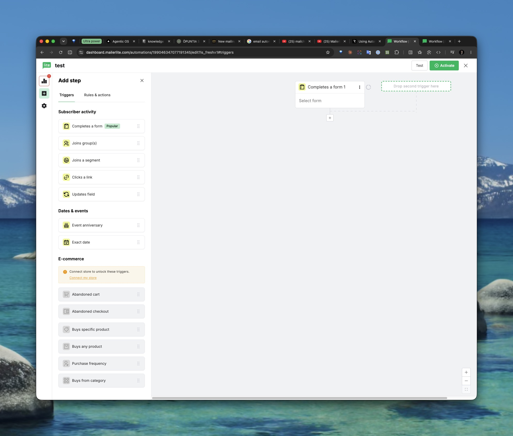
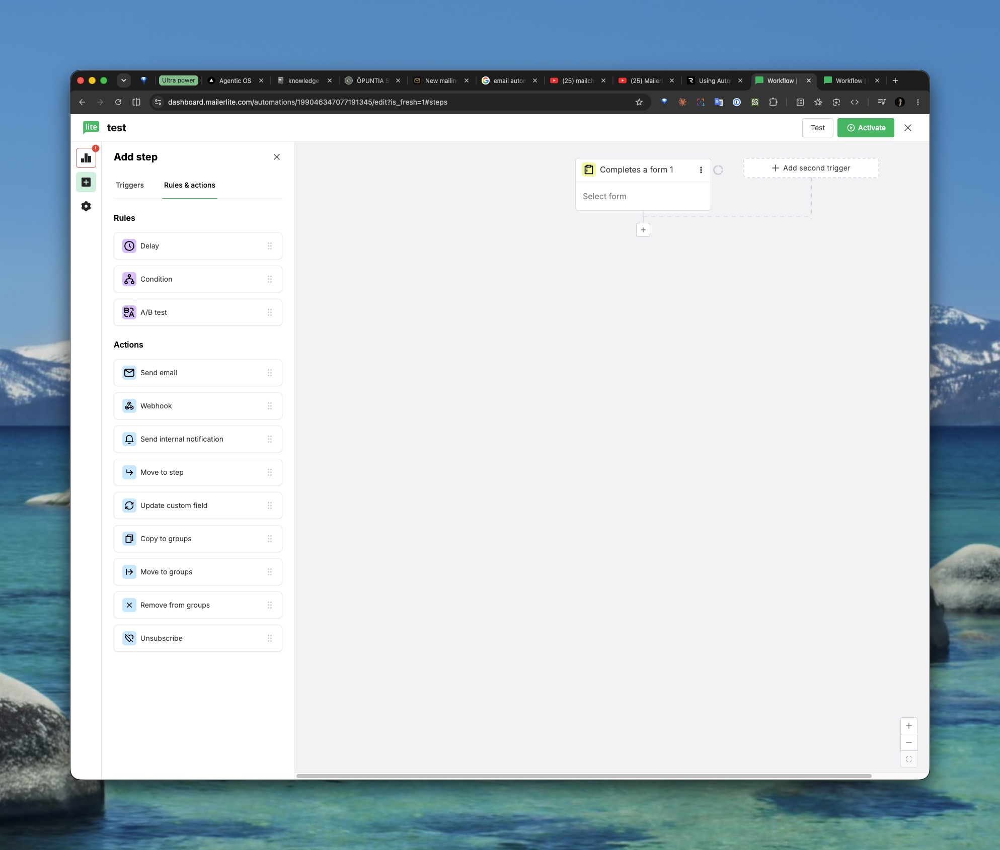
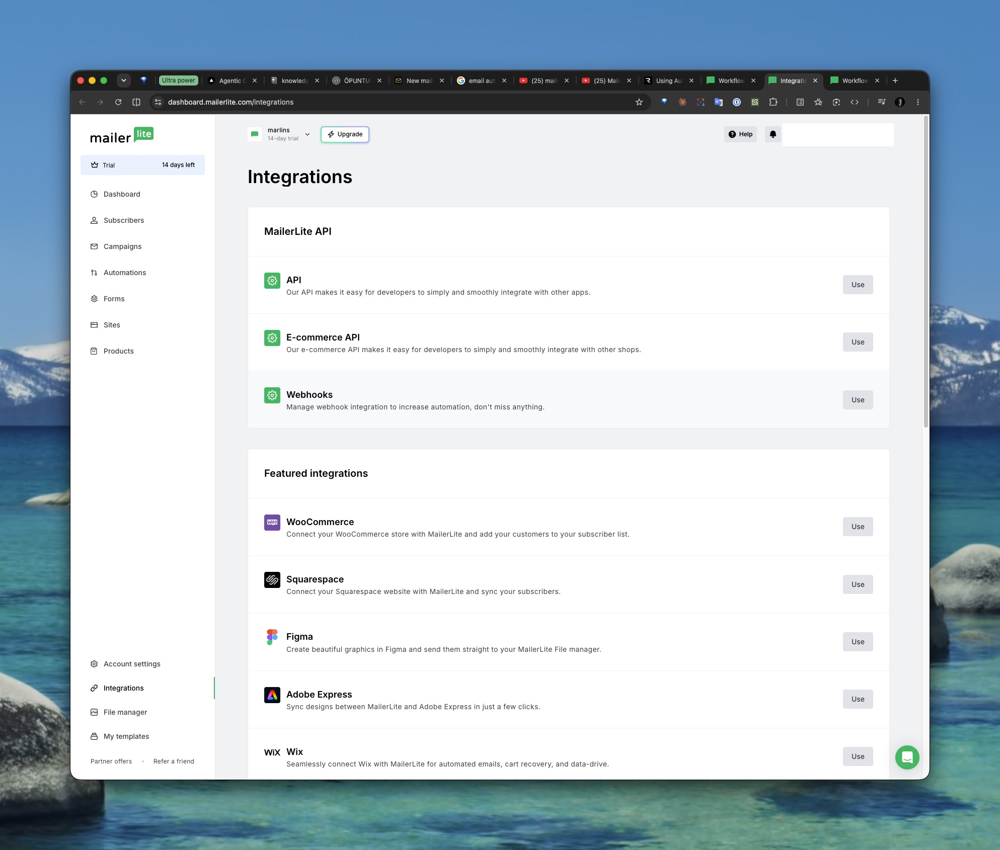

- **Seen (Marlin's screenshots 15 and 16).** The "test" draft with a
  *Completes a form* trigger and a dashed *Add second trigger* slot beside it;
  dropping a trigger there reads "Drop second trigger here". The trigger list
  in three groups (subscriber activity, dates and events, e-commerce), the six
  e-commerce triggers greyed out under "Connect store to unlock these
  triggers". Rules (Delay, Condition, A/B test) and nine actions (Send email,
  Webhook, Send internal notification, Move to step, Update custom field, Copy
  to groups, Move to groups, Remove from groups, Unsubscribe). *Test* and
  *Activate* top right; the left rail's stats (with a red alert dot while the
  flow is incomplete), *Add step* and settings; zoom in, zoom out and fit
  bottom right.

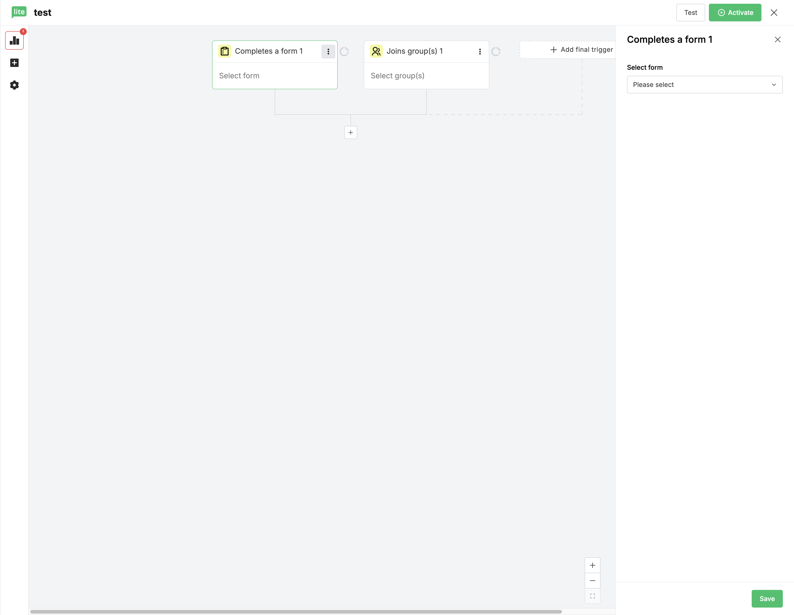
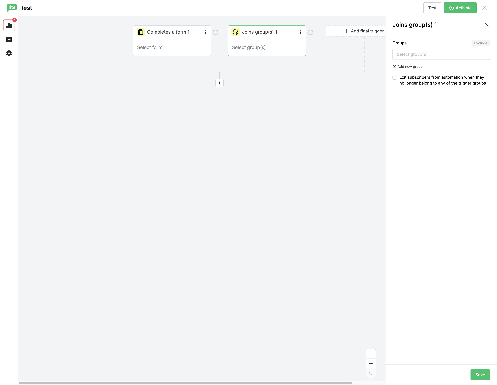

- **Seen (the "test" draft as Marlin left it, opened read-only).** Two
  triggers (*Completes a form 1*, *Joins group(s) 1*) joined above one "+", and
  the third slot now reads *Add final trigger*: three triggers at most. Clicking
  a trigger opens its settings on the right with a *Save* button (not
  pressed). *Completes a form*: one "Select form" picker. *Joins group(s)*: a
  group picker with an *Exclude* switch, *Add new group*, and "Exit subscribers
  from automation when they no longer belong to any of the trigger groups". The
  trial unlocks multiple triggers, which the Free plan does not have.

- **Seen (Integrations, screenshot 17 and the page itself).** Three developer
  entries (*API*, *E-commerce API*, *Webhooks*), then featured integrations:
  WooCommerce, Squarespace, Figma, Adobe Express, Wix, Shoper, Zapier, Canva,
  Shopify, BigCommerce, Facebook Audiences, WordPress, MailerCheck (list
  cleaning), Stripe, and "Connect to 140+ tools".

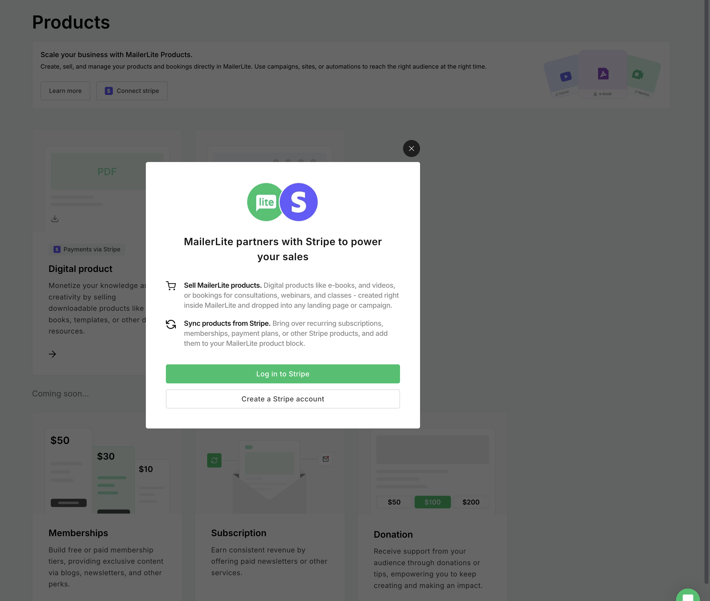

- **Seen (Products).** "Create, sell, and manage your products and bookings
  directly in MailerLite", powered by Stripe: *Connect stripe* ("Sell
  MailerLite products" and "Sync products from Stripe", recurring
  subscriptions and memberships included). Product kinds: Digital product,
  Bookings, and coming soon Memberships, Subscription (paid newsletters) and
  Donation.

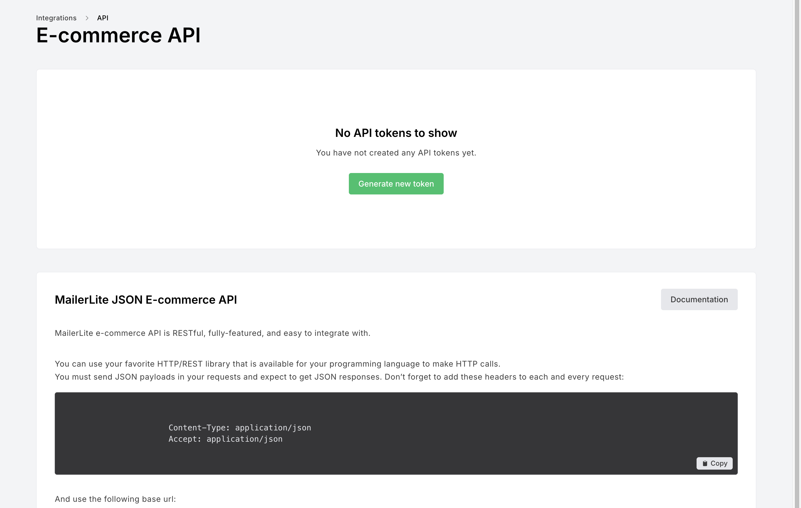

- **Seen (E-commerce API).** A token list ("Generate new token"), the base
  address `https://connect.mailerlite.com/api`, JSON only, a link to the full
  documentation, and the groups store customers are added to.

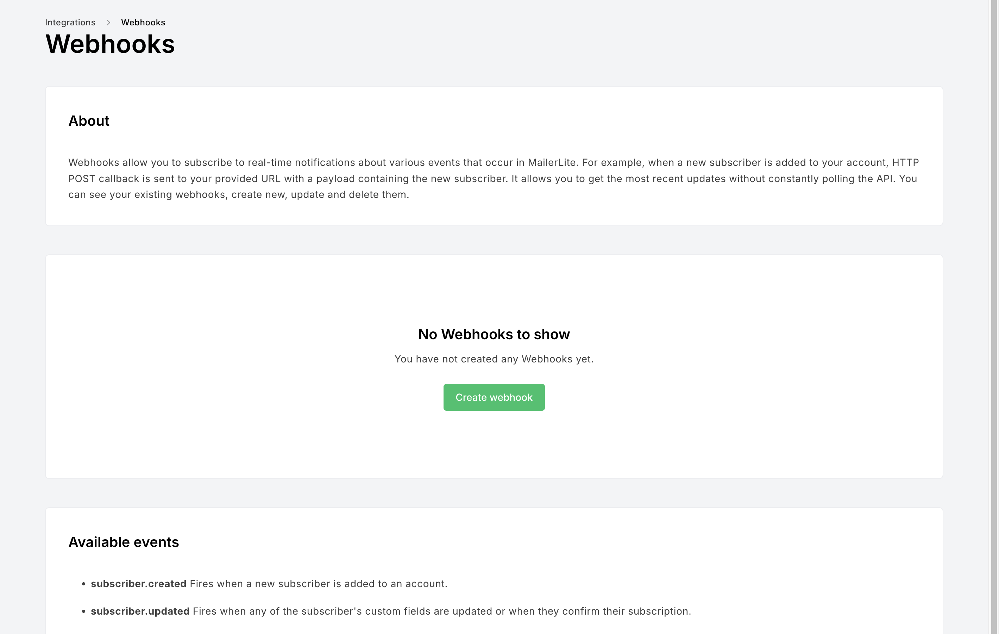

- **Seen (Webhooks).** "No Webhooks to show", *Create webhook*, and the
  available events: `subscriber.created`, `subscriber.updated` (a field changed
  or the subscription was confirmed), `subscriber.unsubscribed`,
  `subscriber.added_to_group`, `subscriber.removed_from_group`,
  `subscriber.bounced`, `subscriber.automation_triggered`,
  `subscriber.automation_completed`, `subscriber.spam_reported`,
  `subscriber.deleted` (batched only), `subscriber.active`,
  `subscriber.form_submitted`, `campaign.sent`, `campaign.open` and
  `campaign.click` (both batched only; MailerLite's own page has the two
  descriptions swapped). **No order, cart or product event exists.**

### MailerLite's E-commerce API (help and developer docs)

Part of the new API (`https://connect.mailerlite.com/api/ecommerce/...`,
a bearer token per integration, optionally restricted by address), 120
requests a minute, imports 5 a minute. Every entity may carry the client's own
`resource_id`.

| Entity | Fields | Endpoints |
| --- | --- | --- |
| Shop | `name`, `url`, `currency` required; `platform`, `group_id` (the group customers join), `enable_popups`, `enabled` | `GET/POST /shops`, `GET/PUT/DELETE /shops/:id` |
| Category | `name`; `exclude_from_automations` | CRUD under the shop, plus a category-product link API |
| Product | `name` required; `price`, `url`, `image`, `short_description` (255 characters), `description`, `categories[]`, `exclude_from_automations`; no variants model | CRUD under the shop |
| Customer | `email` required; `accepts_marketing`, `total_spent`, `create_subscriber`; linked to a subscriber **by email** | CRUD under the shop |
| Order | `customer { email, accepts_marketing, create_subscriber }`, `cart { items[ { ecommerce_product_id, variant, quantity, price } ] }` required; `status` (`pending` or `complete`), `total_price` (the client computes tax, shipping, discounts) | CRUD under the shop; the cart is created by the order |
| Cart | `checkout_url`, `cart_total`; items, customer and order read-only | `GET` and `PUT` only |
| Cart item | `ecommerce_product_id`, `variant` (free text), `quantity`, `price` | CRUD under the cart |
| Import | bulk categories, products, orders | `POST .../categories/import`, `.../products/import`, `.../orders/import` |

**The cart lifecycle is an order lifecycle:** post a `pending` order as soon as
the shopper's email and consent are known (this arms abandoned-cart
automations), add items, then `PUT status: complete` (this fires purchase
automations and cancels the abandoned-cart run). There is no "abandoned"
event: a pending order that is never completed is the abandoned cart, and the
automation's delay does the rest (the help says a cart counts as abandoned 30
minutes after the shopper leaves).

**Connected stores** sync customers, products, categories and orders (and
carts where the platform exposes them), and write per-store fields on the
subscriber: orders count, total spent, accepts marketing. Coverage differs:
Shopify has no abandoned-cart trigger (only abandoned checkout, and only for
returning customers); WooCommerce, PrestaShop, Wix and the API have all six;
Squarespace three. **Only customers who accepted marketing can trigger
e-commerce automations.** Purchases are attributed to the last campaign
clicked within 7, 14 or 30 days.

**E-commerce trigger settings:** abandoned cart and abandoned checkout take a
delay (hours to months) and require a logged-in or identified shopper; buys
any product (the store only); buys a specific product (a product and a
variant); buys from a category; purchase frequency (every 3rd, 5th or 10th
paid order, an optional cap, a delay; re-entry on by default). A purchase
during an abandoned-cart or -checkout run cancels it. Products and categories
marked `exclude_from_automations` never trigger.

**Where purchase data goes:** triggers, as above. **No documented e-commerce
condition** and **no documented e-commerce segment filters**: branching and
segmenting on purchases goes through the synced fields (orders count, total
spent), plus five ready-made segments on Wix. In emails: a product block
("Import from stores") and abandoned-cart and abandoned-checkout blocks that
fill with the shopper's items at send time.

**Plan gating:** e-commerce triggers, integrations and sales tracking,
Shopify, WooCommerce and Stripe, and multiple triggers are Power only
(USD 25 a month); selling digital products, bookings and paid newsletters
start at Comfort.

### Our model: generic events first, commerce entities on top

Two layers, so a client that only wants "send X when Y happens" never has to
model a shop, and a shop gets real data instead of a pile of events.

**1. Custom events (A1).** `POST /v1/events`, already in this plan:
`{ id, name, contact: { external_id | email }, data, occurred_at }`,
idempotent on the client's `id`, stored in `events`, matched by name and by a
filter on `data`. This alone covers ŌPUNTIA ("application.accepted"), a SaaS
("trial.ending") and a shop that only wants a thank-you mail
("order.placed"). The service does not interpret the data; it filters on it
(`data.total > 100`, `data.product_ids contains "p_1"`).

**2. Commerce entities (A3).** Typed, upserted by the client's own ids, so
triggers, conditions, segments and email blocks can reason about products,
categories, carts and orders without every client inventing a payload.

| Table | Columns that matter |
| --- | --- |
| `shops` | `external_id`, `name`, `url`, `currency`, `source` (`api`, `stripe`, `shopify`, `woocommerce`), sealed connector credentials, `topic_id` (the topic shoppers who accept marketing are subscribed to) |
| `products` | `shop_id`, `external_id`, `name`, `url`, `image_url`, `price_minor` (integer minor units), `currency`, `exclude_from_automations`, `active` |
| `product_variants` | `product_id`, `external_id`, `name`, `sku`, `price_minor` (MailerLite has only a free-text variant) |
| `categories`, `product_categories` | `external_id`, `name`, `exclude_from_automations`; many to many |
| `shop_customers` | `shop_id`, `external_id`, `contact_id`, `accepts_marketing`, `consent_at`, `consent_source` |
| `carts` | `shop_id`, `external_id`, `contact_id`, `status` (`open`, `checkout_started`, `converted`, `abandoned`, `expired`), `checkout_url`, `currency`, `total_minor`, `source_updated_at`, `abandoned_at` |
| `cart_items` | `cart_id`, `product_id`, `variant_id`, `quantity`, `unit_price_minor` |
| `orders` | `shop_id`, `external_id`, `contact_id`, `cart_id`, `status` (`pending`, `paid`, `fulfilled`, `refunded`, `cancelled`), `currency`, `total_minor`, `discount_minor`, `placed_at`, `paid_at`, `source_updated_at` |
| `order_items` | `order_id`, `product_id`, `variant_id`, `quantity`, `unit_price_minor` |

Rules the model follows, matching the rest of the service:

- **Money in integer minor units with its currency,** never floats; totals
  compare within one currency.
- **Per-contact metrics are computed on read** (orders count, total spent,
  first and last order, average order value, bought product or category),
  never stored like MailerLite's "Total spent" field, so they cannot drift
  from the orders.
- **Upserts are idempotent and ordered:** keyed by `(shop, external_id)`, and
  an update whose `source_updated_at` is older than the stored one is ignored,
  so webhooks that arrive out of order converge.
- **Consent stays the client's.** `accepts_marketing: true` subscribes the
  contact to the shop's topic with a consent record (source `shop`, the
  shop's own timestamp); `false` creates or updates the contact without a
  subscription. Buying never subscribes anyone by itself, and suppression
  still wins at every send.
- **Each write emits a domain event** in its transaction (`cart.updated`,
  `checkout.started`, `order.placed`, `order.paid`, `order.refunded`), which
  the automation entry step consumes like any other trigger event, and which
  also goes to the workspace's webhook endpoints (MailerLite emits none).
- **Abandonment is detected by a job, not guessed by the client:** an open
  cart (or started checkout) with items and a known contact, untouched for the
  shop's window (default 60 minutes), and no order since, becomes
  `abandoned` and emits `cart.abandoned`. A later order converts it and exits
  every run it started.
- Erasing a contact deletes its carts, orders' contact link (orders stay for
  the shop's totals with `contact_id` NULL, like messages) and
  `shop_customers` rows.

Routes: `shops.*`, `products.upsert` and `.batch`, `categories.upsert`,
`carts.upsert` (items replaced whole), `orders.upsert`, `commerce.import` (a
resumable job like the CSV import), all `write` with key scope `send`, all
idempotent.

### Feeding it: Shopify, WooCommerce, Stripe, and any backend

| Source | How it feeds the model | Carts and checkouts | Consent |
| --- | --- | --- | --- |
| Any backend (ŌPUNTIA, a custom shop) | the commerce routes directly, or only `POST /v1/events` | the client calls `carts.upsert` as the cart changes | the client sends `accepts_marketing` |
| Stripe-based shops (Stripe Checkout, Payment Links) | a restricted key or Stripe Connect, plus a webhook endpoint per shop, verified like the service's own `/stripe/webhook`: `product.*` and `price.*` sync the catalogue, `checkout.session.completed` is a paid order, `charge.refunded` a refund, `customer.subscription.*` subscriptions | `checkout.session.expired` is an abandoned checkout; with recovery enabled Stripe gives a `recovery.url` for the email | Checkout's `consent_collection.promotions` answer |
| WooCommerce | its REST API webhooks (`order.created`, `order.updated`, `product.*`, `customer.*`), signed with `X-WC-Webhook-Signature`, plus a REST backfill; no plugin needed for orders | WooCommerce has no cart webhook: abandoned carts need a small WordPress plugin posting `carts.upsert` (MailerLite ships one too) | a checkout checkbox, sent by the plugin or read from order meta |
| Shopify | a Shopify app (OAuth install) subscribing to `orders/create`, `orders/paid`, `checkouts/create` and `checkouts/update`, `customers/*`, `products/*`, verified by Shopify's HMAC; backfill through the Admin API's bulk operations | checkouts carry `abandoned_checkout_url`; no cart webhook (MailerLite has the same gap) | the customer's `email_marketing_consent` |

Stripe first: the service already verifies Stripe webhooks for its own
billing, most small sellers without a shop platform sell through Stripe
Checkout or Payment Links, and it needs no app review. WooCommerce second
(webhooks without a plugin cover orders). Shopify last: a public app needs
Shopify's review; a custom app per store works earlier for a design partner.

### What it unlocks

| Trigger | Built from | Settings |
| --- | --- | --- |
| Abandoned cart | `cart.abandoned` | shop; delay; minimum cart value; exits on an order |
| Abandoned checkout | `checkout.started` not followed by an order, or Stripe's `checkout.session.expired` | shop; delay; exits on an order |
| Bought any product | `order.paid` | shop; minimum order value; first order only |
| Bought a specific product | `order.paid` with the product (or variant) among the items | product, optionally variant |
| Bought from a category | `order.paid` with an item in the category | category |
| Purchase frequency | the contact's Nth paid order in the shop | every N orders; stop after M; delay |
| Refunded, subscription cancelled | `order.refunded`, `customer.subscription.deleted` | shop, product |

Conditions and segments gain the same facts as fields: has bought product or
category (ever, within N days), orders count, total spent, last order within
N days, average order value, has an open cart. MailerLite documents none of
these as conditions or segment filters. Email content gains merge fields for
the triggering cart or order (`{{cart.checkout_url}}`, items, totals) in A3,
and product and cart blocks in the editor later: the editor refuses new block
types today (the 14 standard ones are fixed in the document model), so a
product block is its own change to the editor's schema, not part of this plan.

Revenue attribution (orders after a click in a mailing) needs click tracking,
so it exists only where tracking is on, never for ŌPUNTIA.

## How it fits the boundary

The service keeps the mail, the client keeps the people. Automations do not
change that:

- A client with its own application (ŌPUNTIA) triggers automations with
  `POST /v1/events` (or `automations.enroll`), naming the contact by its
  `external_id`. What the event means ("application accepted") is the client's;
  the service only matches its name. The client learns what happened through
  the new webhook events, echoed like mailing metadata.
- The service never decides on its own that a person should be emailed beyond
  what the client or the workspace's own signup forms put in: every entry
  needs a subscription to the automation's topic, and suppression wins at
  every send.
- ŌPUNTIA's workspace keeps tracking off, so its automations cannot use click
  triggers or open and click conditions; the canvas hides them and the API
  refuses them with `tracking_disabled`, as segments already do.

## Tests: the four stateful-flow paths

Integration tests on Postgres, the clock driven by the job's `now`, the send
path through `MemoryTransport`:

1. **Forward.** A topic subscription enters a welcome flow; email, wait three
   days, condition on a property, the right branch's email, completion. The
   counts, the journey and the webhook events match the steps.
2. **Backtrack and revise.** Publish an edit while runs wait: a changed delay
   keeps runs at the step with the time recomputed from the step's start; a
   removed step moves its waiting runs as the confirmed preview said (or exits
   them with `step_removed`); a changed email template reaches only runs that
   arrive after the publish. Changing a contact's property before a condition
   step changes the branch it takes; changing it after does not rewrite
   history.
3. **Resume.** Kill the worker between claiming a run and settling it, and
   between queuing an email recipient and its send: on restart no email is sent
   twice (the step execution row and the recipient row decide), and no run is
   lost. After downtime, runs whose `next_action_at` passed are processed in
   order, and quiet hours still hold.
4. **Re-entry after completion or failure.** With re-entry off, a second
   trigger after completion does nothing; with re-entry on, it starts a new run
   (after the cool-down). A person who unsubscribes mid-flow exits, and on
   resubscribing enters again only if re-entry is on. A run failed by a broken
   template can be retried after the fix.

Plus: tenancy (no run, event or step crosses a workspace), the same event
delivered twice, two workers racing on one run, a run hitting the plan's message
limit, the bounce breaker pausing a provider under a live automation, and
erasure of a contact mid-run.

## Phases

- **A0, contract and core.** The flow schema (zod, in the contract), the
  validator, and a pure step evaluator (given a flow, a contact and a time,
  what happens next) with unit tests, reusing the old condition operators.
- **A1, runtime and API.** Tables, the automation job, triggers `topic
  subscribed`, `form confirmed`, `tag added`, `property changed`, `event`,
  `manual`; steps email, duration and weekday delays, condition (property, tag,
  topic, segment), tag, property and topic actions, unsubscribe, exit
  conditions; time zones and quiet hours; `POST /v1/events`; the new events for
  tag and property changes; the email-step send path; plan gating; the four
  paths.
- **A2, dashboard.** The list (active and paused apart from drafts), the
  canvas, the side panel with the editor, validation, publishing with the
  preview, the report and the journey, templates.
- **A3, the rest of MailerLite's set, and commerce.** Date triggers and
  delays, segment entry, link-click trigger and engagement conditions
  (tracking only), A/B split, webhook step, internal notification, move to
  step. The commerce entities and routes, the abandonment job, the commerce
  triggers, conditions and segment fields, cart and order merge fields, and the
  Stripe connector.
- **A3b, shop connectors.** WooCommerce (webhooks, then the small cart
  plugin), then Shopify (a custom app per store for a design partner, a public
  app once reviewed). Only when a customer asks for one.
- **A4, the old package.** Remove `packages/automation` from the workspace once
  A1 and A2 cover it, keeping the condition tests that moved into the service.

## Questions for Marlin

Each has a default this plan assumes until answered.

1. **Email steps as long-lived mailings** (default) or a separate one-by-one
   send table. The default reuses every send-time rule and the analytics; the
   cost is a few special cases in the mailing code (never finishing, the
   per-recipient limit check).
2. **Editing a live automation.** Default: edits go to a draft version, and
   publishing shows where the people waiting at changed or removed steps will
   go, with "exit them" as the alternative. The simpler option (runs keep the
   version they entered with until they finish) avoids the preview but means
   an error fixed in a live flow keeps reaching everyone already inside.
3. **Plan limits.** Default, set against MailerLite's (3 active and 5 steps
   free, 50 on Comfort, unlimited on Power): active automations `free` 3 with
   at most 10 steps each, `starter` 25, `growth` unlimited,
   `design_partner` all; multiple triggers, exits and time zones on every
   plan; the A/B split on `growth` with the A/B feature it already gates;
   automation emails count toward the monthly messages like any send.
4. **Transactional automations** (for example "your booking is confirmed")
   that should reach people who unsubscribed from marketing. Default: not in
   this plan; every automation sends under a topic, and a client sends
   one-off transactional mail through its own provider.
5. **The webhook step's target.** Default: one of the workspace's registered
   webhook endpoints (signed, retried, guarded against server-side request
   forgery (SSRF) already), rather than any URL typed into the step.
6. **ŌPUNTIA's first automation.** Which sequence does ŌPUNTIA want first, and
   which events would its admin send? That decides the order within A1.
7. **The old package.** Default: removed in A4. Keep it only if an external
   host consumes it (none known).
8. **E-commerce in the first release or later?** Default: custom events in A1
   (enough for ŌPUNTIA and for "thank you for your order" from any backend),
   the commerce data model with the Stripe connector in A3, and WooCommerce
   and Shopify only when a customer needs them. The alternative is pulling
   commerce into A1 to compete with MailerLite's Power plan from the start, at
   roughly the size of one more phase.
