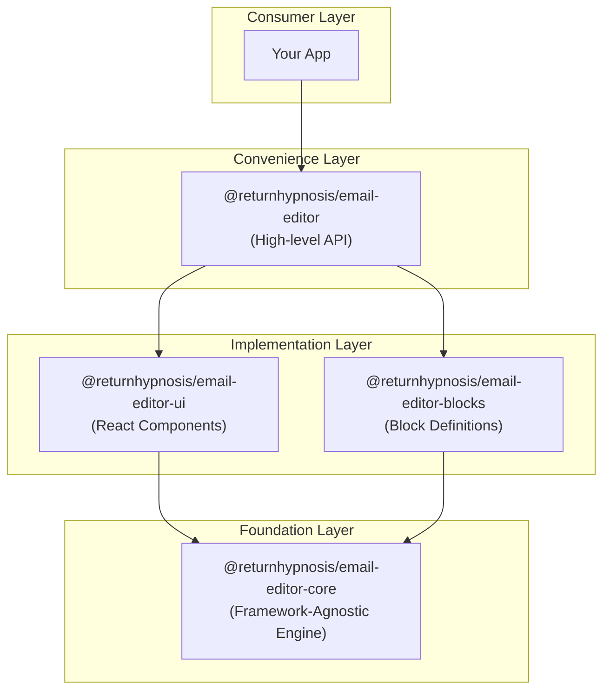
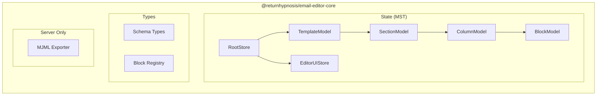
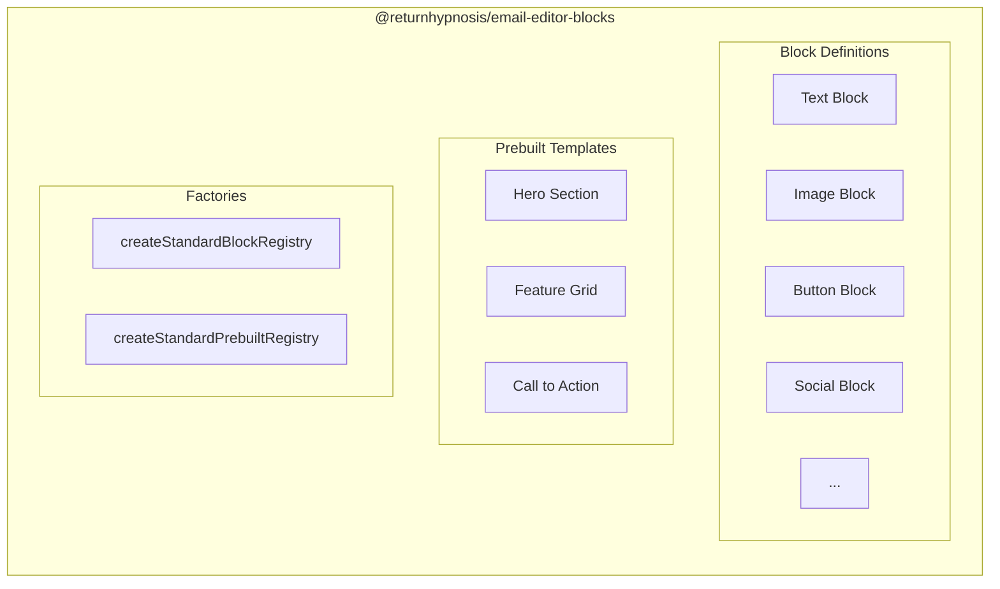
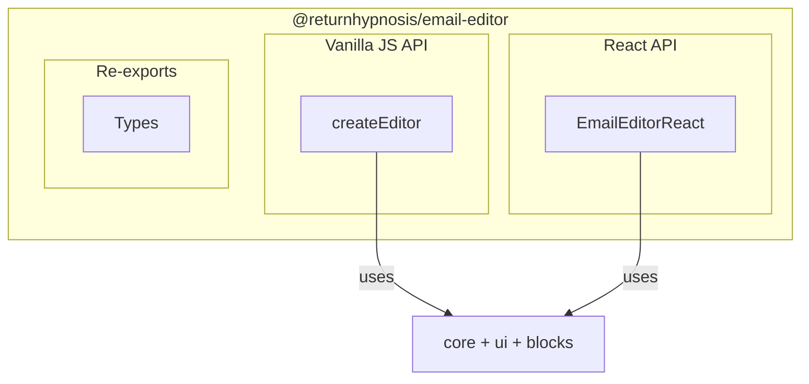
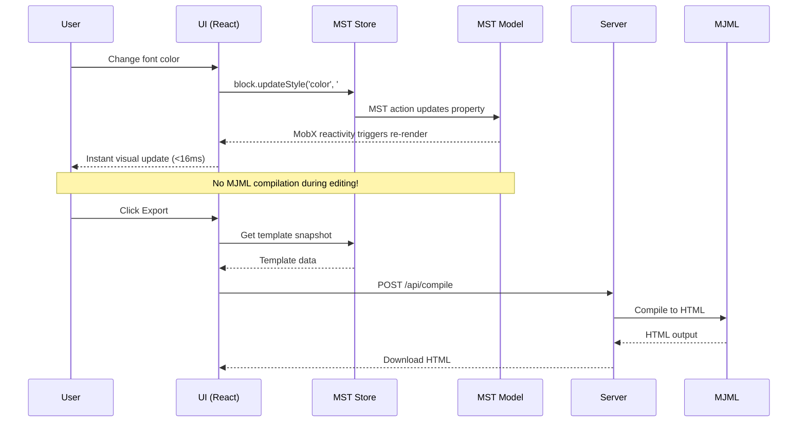
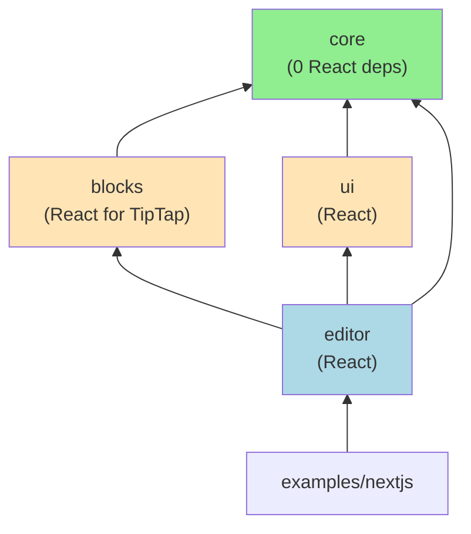

# Email Editor Architecture

## Overview

The email editor is built as a **layered monorepo** with clear separation of concerns. Each package has a specific responsibility and can be used independently or combined.



## Package Responsibilities

### 1. Core Package (`@returnhypnosis/email-editor-core`)

**Purpose:** Framework-agnostic state management, types, and MJML compilation.

**Key Characteristic:** NO React dependency. Can be used with Vue, Svelte, or vanilla JS.



**Exports:**

| Export | Description | Use Case |
|--------|-------------|----------|
| `RootStore`, `createRootStore` | MST store factory | Create editor state |
| `TemplateModel`, `SectionModel`, etc. | MST models | Type-safe state management |
| `BlockType`, `BlockRegistry` | Block definitions | Register custom blocks |
| `EmailTemplate`, `Section`, `Block` | TypeScript types | Type your templates |
| `MJMLExporter` (from `/server`) | MJML compiler | Server-side HTML generation |

**Entry Points:**
- `@returnhypnosis/email-editor-core` - Client-safe (no MJML)
- `@returnhypnosis/email-editor-core/server` - Server-only (includes MJML)

---

### 2. UI Package (`@returnhypnosis/email-editor-ui`)

**Purpose:** React implementation of the visual editor.

**Key Characteristic:** React-specific. Provides the actual UI components.


**Exports:**

| Export | Description |
|--------|-------------|
| `EmailEditor` | Main editor React component |
| `StoreProvider`, `useStore` | React context for MST store |
| `EmailRenderer` | Preview renderer component |
| `PropertyInspector` | Property editing panel |
| Form fields | Reusable input components |

---

### 3. Blocks Package (`@returnhypnosis/email-editor-blocks`)

**Purpose:** Standard block library and prebuilt templates.

**Key Characteristic:** Defines what blocks are available and their default configurations.



**Exports:**

| Export | Description |
|--------|-------------|
| `createStandardBlockRegistry()` | Factory for standard blocks |
| `createStandardPrebuiltRegistry()` | Factory for prebuilt sections |
| Block definitions | Individual block configs |

---

### 4. Editor Package (`@returnhypnosis/email-editor`)

**Purpose:** High-level convenience wrapper for easy integration.

**Key Characteristic:** Combines all packages into simple APIs.



**Exports:**

| Export | Entry Point | Description |
|--------|-------------|-------------|
| `createEditor()` | `@returnhypnosis/email-editor` | Vanilla JS factory |
| `EmailEditorReact` | `@returnhypnosis/email-editor/react` | React component |
| Types | Both | Re-exported for convenience |

---

## Data Flow



---

## Why This Architecture?

### Problem: Slow MJML Compilation

The previous architecture compiled MJML on every property change:

```
Property change → MJML compile (100-300ms) → iframe.write() → Visual update
```

This caused noticeable lag when editing.

### Solution: MST + React Renderer

The new architecture separates editing from compilation:

```
Property change → MST action → MobX observer re-render (<16ms) → Visual update

Export button → MJML compile (once) → HTML output
```

---

## Usage Patterns

### Pattern 1: Full Editor (Most Common)

Use the high-level wrapper for complete functionality:

```tsx
import { EmailEditorReact } from '@returnhypnosis/email-editor/react';
import '@returnhypnosis/email-editor/styles.css';

function App() {
  return (
    <EmailEditorReact
      initialTemplate={myTemplate}
      onChange={(template) => console.log(template)}
      onExport={(template) => sendToServer(template)}
    />
  );
}
```

### Pattern 2: Custom UI with Core State

Use core package directly for custom implementations:

```tsx
import { createRootStore, RootStore } from '@returnhypnosis/email-editor-core';

// Works with any framework!
const store = createRootStore({
  template: myTemplate,
  onChange: (snapshot) => saveToDatabase(snapshot),
});

// Direct MST operations
store.template.addSection(sectionData);
store.template.findBlockById('block-1')?.updateStyle('color', 'red');
```

### Pattern 3: Server-Side Compilation

Use the server export for MJML:

```ts
// api/compile.ts
import { MJMLExporter } from '@returnhypnosis/email-editor-core/server';

const exporter = new MJMLExporter();

export async function POST(request: Request) {
  const template = await request.json();
  const { html, mjml, errors } = exporter.export(template);
  return Response.json({ html, mjml, errors });
}
```

### Pattern 4: Vue/Svelte Implementation

The core is framework-agnostic. You could build a Vue UI:

```ts
// Hypothetical Vue implementation
import { createRootStore } from '@returnhypnosis/email-editor-core';

// Create store (same as React)
const store = createRootStore({ template });

// Use with Vue reactivity
const template = computed(() => store.template);

// Call MST actions
function changeColor(blockId: string, color: string) {
  store.template.findBlockById(blockId)?.updateStyle('color', color);
}
```

---

## File Structure

```
packages/
├── core/                          # Framework-agnostic engine
│   └── src/
│       ├── store/mst/             # MobX State Tree
│       │   ├── models/            # Data models
│       │   │   ├── BlockModel.ts
│       │   │   ├── ColumnModel.ts
│       │   │   ├── SectionModel.ts
│       │   │   └── TemplateModel.ts
│       │   ├── EditorUIStore.ts   # UI state (selection, panels)
│       │   ├── RootStore.ts       # Main store
│       │   └── MJMLExporter.ts    # Server-only compiler
│       ├── schema/                # TypeScript types
│       ├── registry/              # Block registry
│       ├── index.ts               # Client entry
│       └── server.ts              # Server entry (MJML)
│
├── ui/                            # React implementation
│   └── src/
│       ├── store/                 # React bindings
│       │   └── StoreContext.tsx   # Provider + hooks
│       ├── renderer/              # Preview components
│       │   ├── EmailRenderer.tsx
│       │   ├── SectionRenderer.tsx
│       │   ├── ColumnRenderer.tsx
│       │   ├── BlockRenderer.tsx
│       │   └── blocks/            # Block renderers
│       ├── inspector/             # Property panels
│       ├── sidebar/               # Left sidebar
│       └── EmailEditor.tsx        # Main component
│
├── blocks/                        # Block definitions
│   └── src/
│       ├── definitions/           # Block configs
│       ├── prebuilt/              # Prebuilt templates
│       └── index.ts               # Registry factories
│
└── editor/                        # High-level wrapper
    └── src/
        ├── createEditor.ts        # Vanilla JS API
        ├── react.tsx              # React wrapper
        └── types.ts               # Public types
```

---

## Dependency Graph



**Legend:**
- Green = Framework agnostic
- Orange = React-specific
- Blue = Convenience wrapper

---

## Key Design Decisions

1. **MST for State**: MobX State Tree provides fine-grained reactivity, undo/redo via snapshots, and type-safe actions.

2. **MJML on Export Only**: Compilation is expensive (100-300ms). Moving it to export-only gives instant (<16ms) editing feedback.

3. **React in Renderer, Not Core**: The core package has no React dependency. This allows potential Vue/Svelte implementations using the same state engine.

4. **Blocks as Separate Package**: Block definitions are decoupled from rendering. You can use standard blocks or define custom ones.

5. **Two Entry Points for Core**: Client-safe entry excludes MJML (large dependency). Server entry includes it for compilation.
