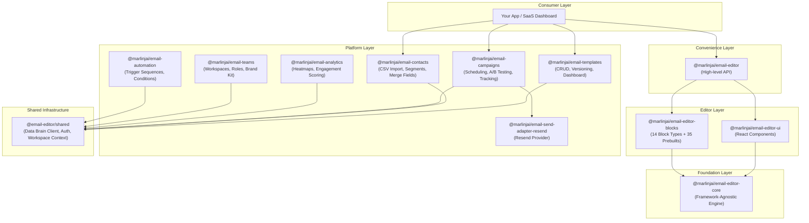
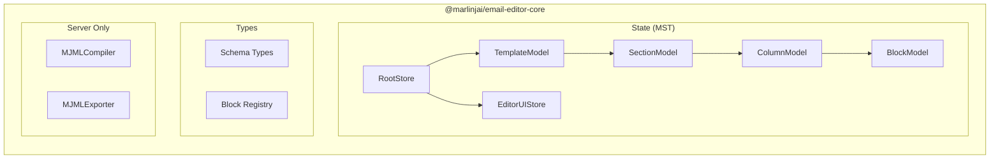
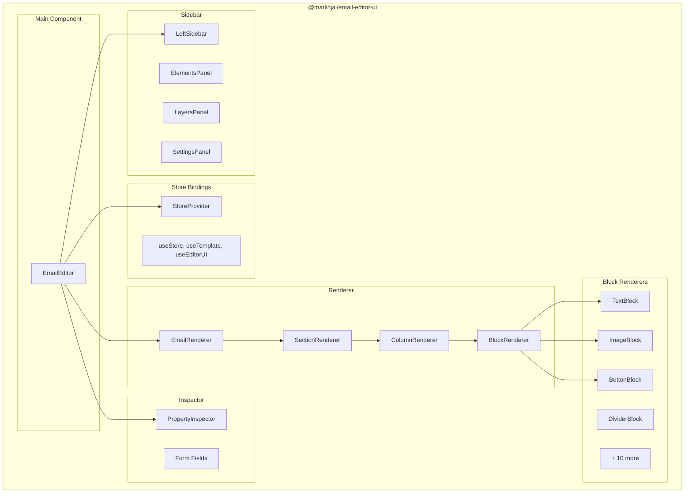
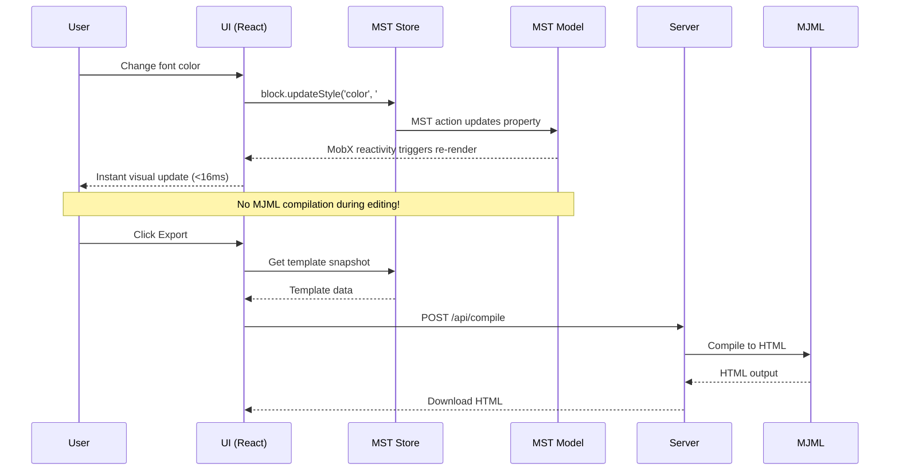
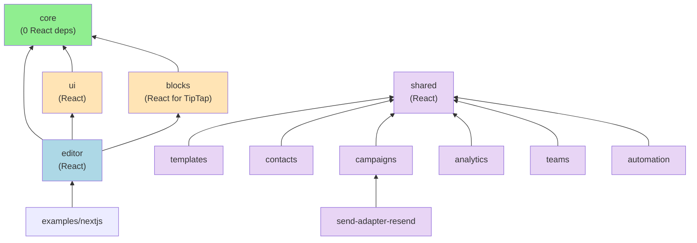

# Email Editor Architecture

## Overview

The email editor is built as a **layered monorepo** with 12 packages organized into two layers: the **Editor Layer** (visual builder) and the **Platform Layer** (email marketing SaaS). Each package has a specific responsibility and can be used independently or combined.



---

## Editor Layer (4 Packages)

### 1. Core Package (`@marlinjai/email-editor-core`)

**Purpose:** Framework-agnostic state management, types, and MJML compilation.

**Key Characteristic:** NO React dependency. Can be used with Vue, Svelte, or vanilla JS.



**Exports:**

| Export | Description | Use Case |
|--------|-------------|----------|
| `RootStore`, `createRootStore` | MST store factory | Create editor state |
| `TemplateModel`, `SectionModel`, etc. | MST models | Type-safe state management |
| `BlockType`, `BlockRegistry` | Block definitions | Register custom blocks |
| `EmailTemplate`, `Section`, `Block` | TypeScript types | Type your templates |
| `MJMLCompiler`, `createMJMLCompiler` (from `/server`) | MJML compiler | Server-side HTML generation |
| `MJMLExporter`, `createMJMLExporter` (from `/server`) | MST-aware exporter | Store-integrated export |

**Entry Points:**
- `@marlinjai/email-editor-core` - Client-safe (no MJML)
- `@marlinjai/email-editor-core/server` - Server-only (includes MJML compiler + exporter)

---

### 2. UI Package (`@marlinjai/email-editor-ui`)

**Purpose:** React implementation of the visual editor.

**Key Characteristic:** React-specific. Provides the actual UI components.



**Exports:**

| Export | Description |
|--------|-------------|
| `EmailEditor` | Main editor React component |
| `StoreProvider`, `useStore` | React context for MST store |
| `EmailRenderer` | Preview renderer component |
| `PropertyInspector` | Property editing panel |
| `DragOverlayContent` | Drag overlay for dnd-kit |
| Form fields | Reusable input components |

---

### 3. Blocks Package (`@marlinjai/email-editor-blocks`)

**Purpose:** Standard block library and prebuilt templates.

**Key Characteristic:** Defines what blocks are available and their default configurations.

**14 Block Types:**

| Block | Type | Category | Description |
|-------|------|----------|-------------|
| Text | `text` | text | Rich text content via TipTap |
| Image | `image` | media | Images with optional links |
| Button | `button` | media | Call-to-action buttons |
| Divider | `divider` | layout | Horizontal lines |
| Spacer | `spacer` | layout | Vertical spacing |
| Social | `social` | media | Social media icon links |
| Hero | `hero` | media | Background image with overlay |
| Accordion | `accordion` | layout | Collapsible content sections |
| Raw HTML | `raw` | layout | Custom HTML injection |
| Navbar | `navbar` | layout | Navigation links |
| Carousel | `carousel` | media | Image slideshows |
| Table | `table` | layout | Tabular data |
| Header | `header` | brand | Branded header (locked) |
| Footer | `footer` | brand | Branded footer (locked) |

**Exports:**

| Export | Description |
|--------|-------------|
| `createStandardBlockRegistry()` | Factory for all 14 standard blocks |
| `createStandardPrebuiltRegistry()` | Factory for 35 prebuilt section templates |
| Block definitions | Individual block configs |

---

### 4. Editor Package (`@marlinjai/email-editor`)

**Purpose:** High-level convenience wrapper for easy integration.

**Key Characteristic:** Combines all packages into simple APIs.

**Exports:**

| Export | Entry Point | Description |
|--------|-------------|-------------|
| `createEditor()` | `@marlinjai/email-editor` | Vanilla JS factory |
| `EmailEditorReact` | `@marlinjai/email-editor/react` | React component |
| Types | Both | Re-exported for convenience |

---

## Platform Layer (8 Packages)

The platform layer extends the editor into a full email marketing SaaS. All packages use **Data Brain** for storage via adapter classes, and share infrastructure through `@email-editor/shared`.

### 5. Templates (`@marlinjai/email-templates`)

Template CRUD with version history. Includes `TemplateManager`, `WorkspaceScopedTemplateManager`, and React components (`TemplateDashboard`, `TemplateCard`, `TemplateVersionHistory`, `CreateTemplateDialog`).

### 6. Contacts (`@marlinjai/email-contacts`)

Contact management with CSV import, segmentation rules, merge field resolution, and RFC 8058 unsubscribe handling. Includes `WorkspaceScopedContactManager` and utilities for segment evaluation.

### 7. Campaigns (`@marlinjai/email-campaigns`)

Campaign lifecycle: create, schedule, A/B test, send, and track. Includes `CampaignManager`, tracking pixel injection, link rewriting, audience splitting, and winner determination.

### 8. Send Adapter - Resend (`@marlinjai/email-send-adapter-resend`)

Implementation of the `SendAdapter` interface for the Resend email provider. Handles single and batch sending with per-recipient error isolation.

### 9. Analytics (`@marlinjai/email-analytics`)

Campaign tracking with open/click/bounce events. Includes `AnalyticsTracker`, engagement scoring, click heatmap generation, campaign comparison, and CSV export.

### 10. Teams (`@marlinjai/email-teams`)

Multi-user workspaces with role-based permissions (`PERMISSIONS` constant), approval workflows, audit logging, and brand kit management. Includes React components for all management UIs.

### 11. Automation (`@marlinjai/email-automation`)

Trigger-based email sequences with step types: `send_email`, `wait`, `condition` (branching), and `split` (variants). Trigger types: `event`, `schedule`, `manual`. Includes `AutomationEngine` and React `SequenceBuilder`.

### 12. Shared (`@email-editor/shared`)

Cross-package infrastructure: Data Brain and Storage Brain client factories, React context providers (`PlatformProvider`, `WorkspaceProvider`, `AuthProvider`), pagination hook, and database schema bootstrapper.

---

## Data Flow



---

## Why This Architecture?

### Problem: Slow MJML Compilation

The previous architecture compiled MJML on every property change:

```
Property change -> MJML compile (100-300ms) -> iframe.write() -> Visual update
```

This caused noticeable lag when editing.

### Solution: MST + React Renderer

The new architecture separates editing from compilation:

```
Property change -> MST action -> MobX observer re-render (<16ms) -> Visual update

Export button -> MJML compile (once) -> HTML output
```

---

## Usage Patterns

### Pattern 1: Full Editor (Most Common)

Use the high-level wrapper for complete functionality:

```tsx
import { EmailEditorReact } from '@marlinjai/email-editor/react';
import '@marlinjai/email-editor/styles.css';

function App() {
  return (
    <EmailEditorReact
      initialTemplate={myTemplate}
      onChange={(template) => console.log(template)}
      onExport={(template) => sendToServer(template)}
    />
  );
}
```

### Pattern 2: Custom UI with Core State

Use core package directly for custom implementations:

```tsx
import { createRootStore, RootStore } from '@marlinjai/email-editor-core';

// Works with any framework!
const store = createRootStore({
  template: myTemplate,
  onChange: (snapshot) => saveToDatabase(snapshot),
});

// Direct MST operations
store.template.addSection(sectionData);
store.template.findBlockById('block-1')?.updateStyle('color', 'red');
```

### Pattern 3: Server-Side Compilation

Use the server export for MJML:

```ts
// api/compile.ts
import { MJMLExporter } from '@marlinjai/email-editor-core/server';

const exporter = new MJMLExporter();

export async function POST(request: Request) {
  const template = await request.json();
  const { html, mjml, errors } = exporter.export(template);
  return Response.json({ html, mjml, errors });
}
```

### Pattern 4: Full SaaS Dashboard

Combine editor with platform packages:

```tsx
import { PlatformProvider } from '@email-editor/shared';
import { TemplateDashboard } from '@marlinjai/email-templates';
import { WorkspaceSwitcher } from '@marlinjai/email-teams';

function Dashboard() {
  return (
    <PlatformProvider dataBrain={config} storageBrain={config}>
      <WorkspaceSwitcher />
      <TemplateDashboard />
    </PlatformProvider>
  );
}
```

---

## File Structure

```
packages/
├── core/                          # Framework-agnostic engine
│   └── src/
│       ├── store/mst/             # MobX State Tree
│       │   ├── models/            # Data models
│       │   │   ├── BlockModel.ts
│       │   │   ├── ColumnModel.ts
│       │   │   ├── SectionModel.ts
│       │   │   └── TemplateModel.ts
│       │   ├── EditorUIStore.ts   # UI state (selection, panels)
│       │   ├── RootStore.ts       # Main store
│       │   └── MJMLExporter.ts    # Server-only exporter
│       ├── compiler/              # MJMLCompiler (server-only)
│       ├── schema/                # TypeScript types + Zod validation
│       ├── registry/              # Block registry
│       ├── index.ts               # Client entry
│       └── server.ts              # Server entry (MJML)
│
├── ui/                            # React implementation
│   └── src/
│       ├── store/                 # React bindings (StoreContext)
│       ├── renderer/              # Preview components
│       ├── inspector/             # Property panels
│       ├── sidebar/               # Left sidebar
│       └── EmailEditor.tsx        # Main component
│
├── blocks/                        # Block definitions
│   └── src/
│       ├── text/                  # Text block
│       ├── image/                 # Image block
│       ├── button/                # Button block
│       ├── divider/               # Divider block
│       ├── spacer/                # Spacer block
│       ├── social/                # Social block
│       ├── hero/                  # Hero block
│       ├── accordion/             # Accordion block
│       ├── raw/                   # Raw HTML block
│       ├── navbar/                # Navbar block
│       ├── carousel/              # Carousel block
│       ├── table/                 # Table block
│       ├── branded/               # Header & Footer blocks
│       ├── prebuilt/              # 35 prebuilt templates
│       └── registry.ts            # createStandardBlockRegistry()
│
├── editor/                        # High-level wrapper
│   └── src/
│       ├── createEditor.ts        # Vanilla JS API
│       ├── react.tsx              # React wrapper
│       └── types.ts               # Public types
│
├── templates/                     # Template management
│   └── src/
│       ├── manager.ts             # TemplateManager
│       ├── data-brain-adapter.ts  # Data Brain adapter
│       ├── workspace-scoped.ts    # Workspace-scoped manager
│       ├── schema.ts              # Table definitions
│       └── components/            # React dashboard UI
│
├── contacts/                      # Contact management
│   └── src/
│       ├── adapter.ts             # Data Brain adapter
│       ├── csv-importer.ts        # CSV import utilities
│       ├── merge-fields.ts        # Merge field resolution
│       ├── segment-evaluator.ts   # Segment rule evaluation
│       ├── unsubscribe.ts         # Unsubscribe handling
│       └── workspace-scoped.ts    # Workspace-scoped manager
│
├── campaigns/                     # Campaign management
│   └── src/
│       ├── manager.ts             # CampaignManager
│       ├── adapter.ts             # Data Brain adapter
│       ├── tracking.ts            # Pixel injection, link rewriting
│       ├── scheduler.ts           # Schedule queries
│       └── ab-testing.ts          # A/B test utilities
│
├── send-adapter-resend/           # Resend provider
│   └── src/
│       └── index.ts               # ResendSendAdapter
│
├── analytics/                     # Analytics & tracking
│   └── src/
│       ├── tracker.ts             # AnalyticsTracker
│       ├── adapter.ts             # Data Brain adapter
│       ├── endpoints.ts           # Open/click tracking handlers
│       ├── engagement.ts          # Engagement scoring
│       ├── heatmap.ts             # Click heatmap generation
│       ├── comparison.ts          # Campaign comparison
│       └── export.ts              # CSV export
│
├── teams/                         # Teams & workspaces
│   └── src/
│       ├── workspace-manager.ts   # WorkspaceManager
│       ├── approval.ts            # ApprovalManager
│       ├── audit-log.ts           # AuditLogger
│       ├── brand-kit.ts           # BrandKitManager
│       └── components/            # React management UIs
│
├── automation/                    # Automation sequences
│   └── src/
│       ├── engine.ts              # AutomationEngine
│       ├── adapter.ts             # Data Brain adapter
│       ├── condition-evaluator.ts # Condition evaluation
│       └── components/            # SequenceBuilder UI
│
└── shared/                        # Cross-package infrastructure
    └── src/
        ├── clients/               # Data Brain, Storage Brain factories
        ├── context/               # PlatformProvider, WorkspaceProvider, AuthProvider
        ├── hooks/                 # usePaginatedQuery
        ├── schema/                # Database bootstrapper
        └── types.ts               # Shared types
```

---

## Dependency Graph



**Legend:**
- Green = Framework agnostic
- Orange = React-specific (editor)
- Blue = Convenience wrapper
- Purple = Platform layer

---

## Key Design Decisions

1. **MST for State**: MobX State Tree provides fine-grained reactivity, undo/redo via snapshots, and type-safe actions.

2. **MJML on Export Only**: Compilation is expensive (100-300ms). Moving it to export-only gives instant (<16ms) editing feedback.

3. **React in Renderer, Not Core**: The core package has no React dependency. This allows potential Vue/Svelte implementations using the same state engine.

4. **Blocks as Separate Package**: Block definitions are decoupled from rendering. You can use standard blocks or define custom ones.

5. **Two Entry Points for Core**: Client-safe entry excludes MJML (large dependency). Server entry includes it for compilation.

6. **Data Brain for Storage**: All platform packages use the adapter pattern with Data Brain as the primary storage backend, making them database-agnostic.

7. **Shared Infrastructure**: Cross-cutting concerns (auth, workspace context, client factories) live in `@email-editor/shared` to avoid duplication across platform packages.

8. **Workspace Scoping**: Platform managers support workspace-scoped operations for multi-tenant SaaS deployment.
