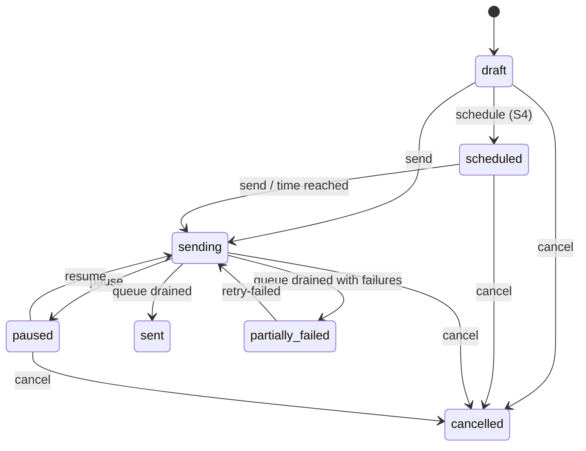

# Mail service API contract (v1)

`@marlinjai/mail-contract` is the single definition of the mail service's v1
Application Programming Interface (API). The service (`apps/service`), the typed
client (`@marlinjai/mail-sdk`) and the dashboard (`apps/dashboard`) all import it;
none of them keeps its own copy of a request or response shape. A change to the API
is a change to this package first.

It depends on `zod` 3 only and uses no Node built-ins, so it runs in Node, in the
browser and on edge runtimes. Consumers must resolve the same zod 3 major: mixing in
zod 4 breaks type identity between packages.

## What is in it

| Module | Contents | Phase |
| --- | --- | --- |
| `common` | `Id` (opaque string), `Timestamp` (ISO 8601 with offset), `Email`, `Slug`, `Properties`, cursor pagination (`PageQuery`, `page()`) | all |
| `errors` | `ErrorCode` union, `ERROR_STATUS` (code to HTTP status), the `ErrorBody` envelope, `RETRYABLE_ERRORS` | all |
| `headers` | `Authorization`, `Idempotency-Key`, the dashboard's subject and workspace headers, request id | all |
| `workspace` | workspaces, members and roles, API keys, the audit log | S0 (foundation) |
| `templates` | template documents and versions, compile request and result, uploaded assets | S1 (editor and templates) |
| `providers`, `contacts`, `mailings`, `webhooks` | providers with policies, topics, contacts, suppressions, mailings and their state machine, recipients, the sent archive, webhook endpoints, deliveries and events | S2 (sending) |
| `platform` | tags, segments with a filter tree, signup forms, CSV import jobs, scheduling, A/B tests, analytics | S4 (typed, not served yet) |
| `billing` | plans, limits, subscription, usage, checkout | S5 (typed, not served yet) |
| `routes` | the route table, `buildPath`, `matchRoute`, `acceptsIdempotencyKey` | all |
| `webhook-signing` | `signWebhook`, `verifyWebhook` and the header constants | S2 |
| `unsubscribe` | the unsubscribe token layout (types only), reserved merge fields | S2 |

## Conventions

- **JSON on the wire, snake_case fields.** Timestamps are strings, never `Date`.
- **Ids are opaque.** Clients never parse or construct them.
- **Request schemas validate, they do not transform** (apart from trimming an
  email and coercing a query-string `limit`). Lowercasing an email is the
  service's job.
- **Lists are cursor-paginated:** `?cursor=&limit=` (1 to 100, default 50) and a
  `{ data, next_cursor }` response, `next_cursor` null on the last page.
- **Reads strip unknown fields.** A secret posted where a read shape is parsed
  never survives into the parsed value.

## Authentication

A client (ŌPUNTIA's admin, any customer's backend) sends
`Authorization: Bearer <workspace API key>`. The key is scoped to one workspace and
to `full`, `send` or `read`.

The dashboard calls server-side with its service token in `Authorization`, plus
`x-mail-subject` (the signed-in person's auth-brain subject) and `x-mail-workspace`.
The service checks that person's membership and role on every call. Members are
bound by auth-brain subject: the dashboard resolves the person and posts
`{ subject, email, name, role }`, since the service never sees a login. The
liveness probe is `GET /healthz`, outside `/v1` and without credentials.

Every route declares an `access` level:

| Access | API key scope | Member role |
| --- | --- | --- |
| `read` | any | viewer or above |
| `write` | `send` or `full` | editor or above |
| `admin` | `full` | admin or above |
| `dashboard` | refused | dashboard token plus `x-mail-subject`, no workspace yet (create a workspace, list the person's workspaces) |
| `public` | none | none (signup form submission only) |

## Errors

Every non-2xx response is `{ "error": { "code", "message", "details"? } }`. Switch on
`code`, never on `message`. The codes and their statuses are `ERROR_STATUS` in
`errors.ts`; the ones a sending client meets most:

| Code | Status | When |
| --- | --- | --- |
| `validation_failed` | 400 | the body or query does not match the schema; `details.issues` lists the paths |
| `invalid_api_key`, `api_key_revoked` | 401 | the key is unknown or revoked |
| `insufficient_role` | 403 | the key scope or member role is below the route's access |
| `mailing_invalid_state` | 409 | the action is not allowed in the mailing's status |
| `idempotency_key_reused` | 409 | the same key was sent with a different body |
| `conflict` | 409 | a template save based on an outdated `base_version` |
| `missing_unsubscribe_url` | 422 | a broadcast whose document lacks `{{unsubscribe_url}}` |
| `compile_failed` | 422 | sending a document whose compile reported errors |
| `daily_budget_exhausted` | 429 | the provider's rolling 24 hour budget is spent |

## Idempotency

Every mutating call (anything but GET) accepts `Idempotency-Key`. A replay with
the same key and body within 24 hours returns the first response; the same key with
a different body is `idempotency_key_reused`. The SDK sends a key on every
mutating request, so a retry after a network failure never applies twice.

Adding recipients is idempotent on the email address even without a key: a batch
reports `added`, `already_present` and `rejected` (by index).

## Mailings: states and actions



`MAILING_TRANSITIONS` holds this table as data, and `canTransition(status, action)`
answers from it; the service, the dashboard buttons and the SDK all read the same
table. Any other combination is `mailing_invalid_state`.

Recipients move `queued`, `sending`, then `sent`, `failed` or `skipped`. A skipped
recipient has a `skip_reason`: `suppressed`, `not_subscribed`, `contact_erased`,
`cancelled`, or `outcome_unknown`. The last one marks a recipient the worker was
sending to when it crashed, with no archived message to prove whether the provider
accepted it. It is never retried automatically, because a duplicate cannot be
unsent: `retry-failed` requeues it only with `include_outcome_unknown: true`, which
is a human's decision.

A mailing's `metadata` (up to 20 string values) is echoed in every message webhook,
so a client can file an event (who sent it, what kind of mailing) without a lookup.

## Compile

`POST /v1/templates/:id/compile` and `POST /v1/compile` both return
`{ mjml, html, warnings, errors }` with status 200 whenever compilation ran. A
non-empty `errors` means the HTML must not be sent; `warnings` are shown and do not
block. Only an unreadable document is a 4xx.

## Merge fields

`{{name}}` in a document is filled per recipient, HTML-escaped, from the
recipient's `merge` values and then the contact. A fallback is written
`{{first_name|there}}`. Reserved names (`RESERVED_MERGE_FIELDS`): `first_name` and
`last_name` (with fallback), `email`, and `unsubscribe_url`, which the service fills
and which every broadcast must contain. `missingRequiredMergeFields(html)` is the
check the service runs before `send`.

## Webhooks

Events: `message.sent`, `message.failed`, `contact.unsubscribed`,
`contact.resubscribed`, `contact.bounced`, `mailing.finished`.
`contact.resubscribed` has the shape of `contact.unsubscribed` with
`resubscribed_at` in place of `unsubscribed_at`: an `unsubscribed` block was
lifted, by the person on the hosted page (`hosted_page`), or through
`suppressions.delete` (`api`, `dashboard`). Topic null means the block on every
topic was lifted. Lifting a bounce, complaint or manual block sends nothing. A
resubscribe on the hosted page to one topic also subscribes the contact to it;
an API lift leaves subscriptions to your next upsert. A mirror that
applies unsubscribes must apply it too, or it keeps excluding someone who asked
to receive mail again. After an all-topics unsubscribe, a `contact.resubscribed` naming a topic
lifts that topic only: the service turns the block on everything into blocks on
every other topic, so a mirror that models "all topics" as one flag must expand
it into per-topic blocks before applying the event. Every body is one envelope,
`{ id, type, created_at, workspace_id, data }`, parsed with `WebhookEvent` (a
union discriminated on `type`). Deliveries may repeat: deduplicate on `id`.

Signing, per endpoint secret (prefix `whsec_`, shown once on create and on
rotation):

| Header | Value |
| --- | --- |
| `x-mail-timestamp` | Unix time in seconds |
| `x-mail-signature` | `v1=<hex HMAC-SHA256 over "${timestamp}.${rawBody}">`, several comma-separated during a rotation |
| `x-mail-event-id` | the event id |

A receiver verifies against the raw body before parsing and rejects anything more
than 300 seconds from its clock:

```ts
import { verifyWebhook, WebhookEvent, WEBHOOK_SIGNATURE_HEADER, WEBHOOK_TIMESTAMP_HEADER } from '@marlinjai/mail-contract';

export async function POST(req: Request) {
  const rawBody = await req.text();
  const check = await verifyWebhook({
    secret: process.env.MAIL_WEBHOOK_SECRET!,
    rawBody,
    signatureHeader: req.headers.get(WEBHOOK_SIGNATURE_HEADER),
    timestampHeader: req.headers.get(WEBHOOK_TIMESTAMP_HEADER),
  });
  if (!check.ok) return new Response(check.reason, { status: 401 });
  const event = WebhookEvent.parse(JSON.parse(rawBody));
  // handle event.type, idempotently on event.id
  return new Response(null, { status: 204 });
}
```

HMAC is a hash-based message authentication code: only a holder of the secret can
produce a matching signature. The helpers use Web Crypto and compare in constant
time. A failed delivery is retried up to 8 times with growing delays (30 seconds up
to 6 hours) and is visible with its status under `/v1/webhooks/:id/deliveries`.

## Unsubscribe

The hosted page lives at `<service>/u/<token>`: GET shows the topics, POST applies,
so link scanners never unsubscribe anyone. One-click unsubscribe (RFC 8058, the
Request for Comments that defines `List-Unsubscribe-Post`) posts to the same URL.
The token is an HMAC over workspace, contact, mailing and topic
(`UnsubscribeTokenClaims`); only the service holds the key, so the contract
documents the layout and implements nothing. Clients never build the link.

## Route table

`routes` maps each operation id to its method, path, schemas, success status,
access level and phase:

```ts
import { routes, buildPath, type RouteBody, type RouteResponse } from '@marlinjai/mail-contract';

const r = routes['mailings.addRecipients'];
const url = buildPath(r.path, { id: mailingId });          // "/v1/mailings/mlg_1/recipients"
const body: RouteBody<'mailings.addRecipients'> = { recipients: [{ external_id: 'p1', email: 'a@b.de' }] };
type Result = RouteResponse<'mailings.addRecipients'>;     // { added, already_present, rejected }
```

The phases are separate namespaces (`foundationRoutes`, `templateRoutes`,
`sendingRoutes`, `platformRoutes`, `billingRoutes`) merged into `routes`. S4 and S5
routes are typed so those phases extend the contract rather than invent it; the
service answers them with `not_found` until they ship.
